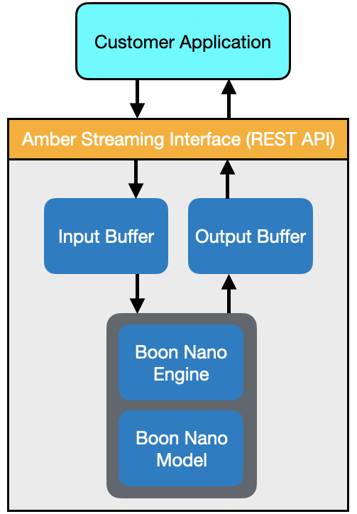

  
# Boon Logic Application Interface Documentation

<table class="table">
  <tr>
    <td></td>  
  </tr>
  <tr>
    <td><em>The Amber Streaming API provides a straight-forward interface to the Boon Nano clustering engine.</em></td>
  </tr>
</table>

## The Boon Nano: The Core Technology

**[Introduction to the Boon Nano](docs/NanoDocs/Overview.md#Intro)**

**[Examples of Patterns](docs/NanoDocs/Overview.md#ExamplePatterns)**

**[Using the Boon Nano](docs/NanoDocs/Overview.md#Using)**

**[Configuring the Boon Nano](docs/NanoDocs/Overview.md#Configuration)**

**[Clustering Results](docs/NanoDocs/Overview.md#Results)**

**[Nano Status: Accessing the Current Nano Model](docs/NanoDocs/Overview.md#NanoStatus)**

**[Root Cause Analysis](docs/NanoDocs/Overview.md#RootCause)**

**[Example](docs/NanoDocs/Overview.md#Example)**

## Amber: Streaming Analytics
**[Introduction to Amber](docs/AmberDocs/Overview.md/#Intro)**

**[Operational Overview](docs/AmberDocs/Overview.md/#Operation)**

* *[Amber Training Phases](docs/AmberDocs/Overview.md/#Operation)*
* *[Amber Training Example](docs/AmberDocs/Overview.md/#Operation_Example)*

**[Definitions and Terminology](docs/AmberDocs/Overview.md/#Definitions)**

**[Configuring Amber](docs/AmberDocs/Overview.md/#Configuring_Amber)**

* *[Single-Feature Versus Multi-Feature Processing](docs/AmberDocs/Overview.md/#Configuring_Amber)*
* *[Single-Feature Processing](docs/AmberDocs/Overview.md/#Single_Feature)*
* *[Multi-Feature Processing (Sensor Fusion)](docs/AmberDocs/Overview.md/#Multi_Feature)*
* *[Configuration Parameters](docs/AmberDocs/Overview.md/#Config_Params)*

**[Amber Input Data Recommendations](docs/AmberDocs/Overview.md/#Data_Input_Recommendations)**

* *[Confounding Features](docs/AmberDocs/Overview.md/#Confounding)*
* *[Redundant and Poorly Correlated Features](docs/AmberDocs/Overview.md/#Redundant)*
* *[Missing Data and Variable Sample Rates](docs/AmberDocs/Overview.md/#Missing)*
* *[Categorical Data](docs/AmberDocs/Overview.md/#Categorical)*

**[Amber Training Recommendations](docs/AmberDocs/Overview.md/#Training_Recommendations)**

* *[The Autotuning Buffer](docs/AmberDocs/Overview.md/#Autotuning_Buffer)*
* *[The Training Buffer](docs/AmberDocs/Overview.md/#Training_Buffer)*
* *[Anomalies During Training](docs/AmberDocs/Overview.md/#Anomalies_During_Training)*
* *[Using Pretraining](docs/AmberDocs/Overview.md/#Pretraining)*
* *[Re-enabling Learning](docs/AmberDocs/Overview.md/#Enable_Learning)*

**[Amber Outputs](docs/AmberDocs/Overview.md#Amber_Outputs)**

* *[(ID) Cluster ID](docs/AmberDocs/Overview.md#ID)*
* *[(SI) Smoothed Anomaly Index](docs/AmberDocs/Overview.md#SI)*
* *[(RI) Raw Anomaly Index](docs/AmberDocs/Overview.md#RI)*
* *[(AD) Anomaly Detections](docs/AmberDocs/Overview.md#AD)*
* *[(AH) Anomaly History](docs/AmberDocs/Overview.md#AH)*
* *[(AM) Anomaly Metric](docs/AmberDocs/Overview.md#AM)*
* *[(AW) Amber Warning Level](docs/AmberDocs/Overview.md#AW)*
* *[(RC) Root Cause Analysis](docs/AmberDocs/Overview.md#RC)*

**[Amber Model Status](docs/AmberDocs/Overview.md#Amber_Model)**  

**Examples**

* *[Anomaly Detection in a Single-Sensor Asset](docs/AmberDocs/SingleSensorExample/SingleSensorExample.md)*
* *[Anomaly Detection in a Multi-Sensor Asset (Sensor Fusion)](docs/AmberDocs/SensorFusionExample/SensorFusionExample.md)*

**[Amber Licensing](docs/Amber_License.md#Amber_Model)**

**Amber Programming Interfaces**

* *[REST API](docs/Amber_REST.md)*
* *[Python SDK](https://boonlogic.github.io/amber-python-sdk)*
* *[Javascript SDK](https://boonlogic.github.io/amber-javascript-sdk)*
* *[C++ SDK](https://boonlogic.github.io/amber-cpp-sdk)*
* *[Go SDK](https://boonlogic.github.io/amber-go-sdk)*
* *[R SDK](https://boonlogic.github.io/amber-r-sdk)*
* *[C# SDK](https://boonlogic.github.io/amber-csharp-sdk)*

## AVIS DICOM

[Visual Inspection of Mammography Images](https://boonlogic.github.io/AVIS-DICOM/)
