   
# Outline

* **[Introduction](#Intro)**

* **[Definitions and Terminology](#Definitions)**

* **[Configuring Amber](#Configuring_Amber)**

 - *[Single-Feature Processing](#Single_Feature)*
 - *[Multi-Feature Processing](#Multi_Feature)*

* **[Data Input Recommendations](#Data_Input_Recommendations)**

 - *[Confounding Features](#Confounding)*
 - *[Redundant and Poorly Correlated Features](#Redundant)*
 - *[Missing Data and Variable Sample Rates](#Missing)*
 - *[Categorical Data](#Categorical)*

* **[Understanding Amber Outputs](#Amber_Outputs)**

* **Examples**

  - *[Single-Sensor Example](#Single_Sensor_Time_Series)*
  - *[Multi-Sensor Example](#./SensorFusionExample/SensorFusionExample.md)*

## Introduction
Amber is a real-time, predictive analytics platform that uses unsupervised machine learning to build high-dimensional models that are individualized to each asset being monitored. Typical assets include include pumps, generators, engines, boilers, etc. However, an **asset** can be broadly defined as any entity with *correlated* measurements that define its operating state. With this definition we can broaden our list of assets.

* Motors, pumps, generators: temporally-correlated vibration (FFTs for instance), current, voltage, temperature
* Production processes: temporally-correlated units per minute, rejects per minute, average pH, airflow, robotic motion profiles, etc.
* Biological processes: temporally-correlated biomarkers such as multielectrode EEGs, ECG measurements, blood-pressure, temperature
* Network traffic: TCP packet header fields and temporally-correlated traffic in network conversations
* Video streams: correlated features within each frame and also the time series correlation across successive frames

## Definitions and Terminology

Amber consumes sensor data values as it builds its machine learning models and monitors assets and processes. Values are sent to Amber as comma-separated values (CSV) and support IEEE 32-bit floating-point range and precision. Many assets to be monitored have several values that can be sampled at the same moment in time thereby creating a "snapshot" of the state of that asset at that moment. By assembling these measurements into a single vector (a sequence of comma-separated values), we create a **sensor fusion** vector for that asset at that moment in time (Figure BBB). In some cases, the temporal sequence of sensor fusion vectors may have predictive value in describing normal operation of the asset. In this case, the **streaming window size** parameter creates a multivariate time series that will be learned and monitored by Amber (Figures BBB and CCC). In this case, we define a **pattern** as that time series of sensor fusion vectors. Note that patterns *overlap* temporally adjacent sensor fusion vectors with a new pattern being created by each newly arriving sensor fusion vector. 

<table class="table">
  <tr>
    <td>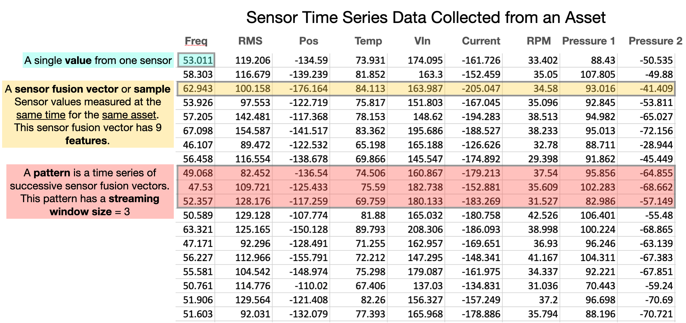</td>
  </tr>
  <tr>
    <td><em>Figure AAA: Basic definitions for understanding Amber processing.</em></td>
  </tr>
</table>

<table class="table">
  <tr>
    <td>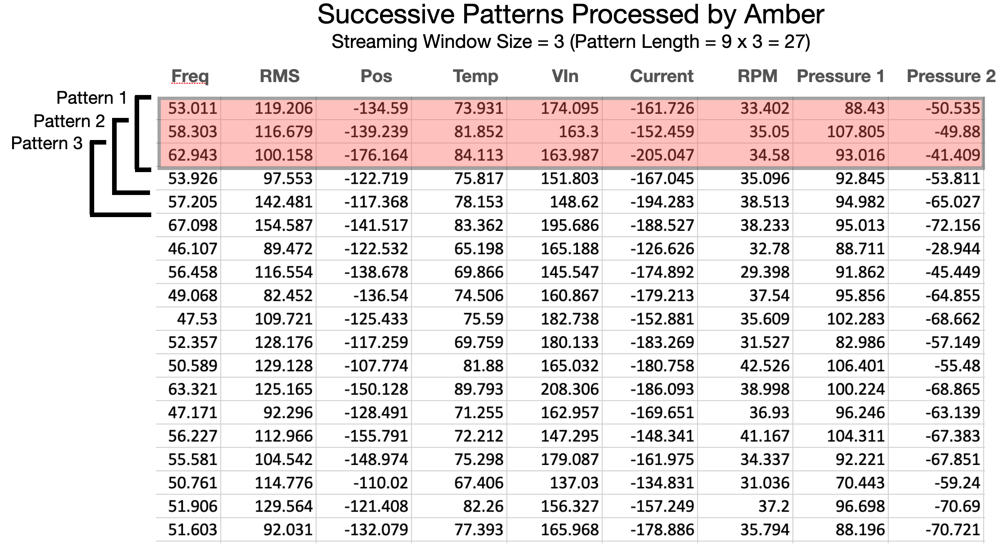</td>
  </tr>
  <tr>
    <td><em>Figure BBB: Amber processes overlapping patterns moving forward in the data stream one sensor fusion vector at a time. Each pattern is assigned a cluster ID, and anomaly index and several other ML-based values.</em></td>
  </tr>
</table>

<table class="table">
  <tr>
    <td>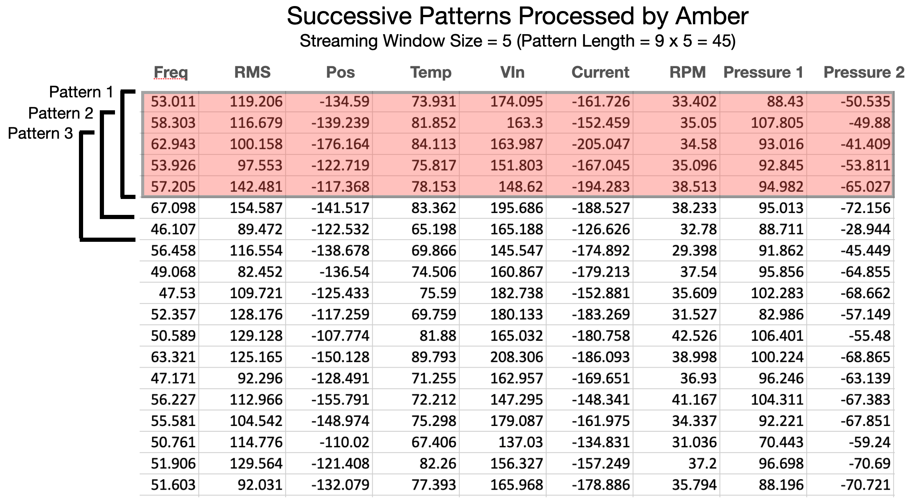</td>
  </tr>
  <tr>
    <td><em>Figure CCC: The pattern length is the product of the number of features (in each sensor fusion vector) times the streaming window size.</em></td>
  </tr>
</table>

One special case is the *single-sensor* time series where there is only one feature in the sensor fusion vector (Figure DDD) and the streaming window size defines the pattern that is consumed by Amber. Details and examples for configuring these parameters of Amber is provided [below](#Pattern_Configuration).

<table class="table">
  <tr>
    <td>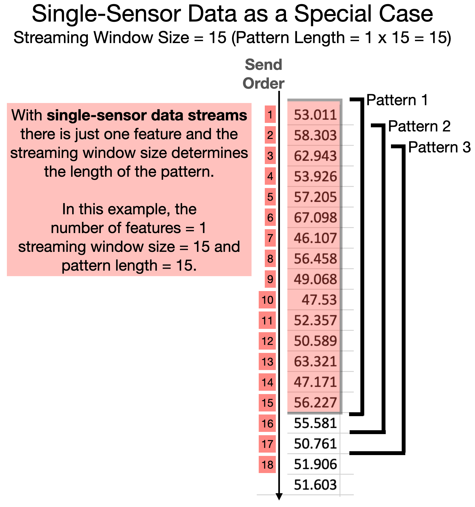</td>
  </tr>
  <tr>
    <td><em>Figure DDD: A one-dimensional time series can be processed by configuring Amber with only one feature and with a streaming window size equal to the number of successive values from the sensor to be processed as one pattern. Each successive value only needs to be sent one time. Amber manages the overlapping of the streaming window.</em></td>
  </tr>
</table>

The order of sending values to Amber is a simple, comma-separated sequence as shown in Figure EEE. Amber will have already been configured to know the length of each sensor fusion vector so there is no need delimit sensor fusion vectors, however, it is important that there are no missing values and that every feature in each sensor fusion vector is sent to retain parity as Amber parses the incoming stream of values. 

<table class="table">
  <tr>
    <td>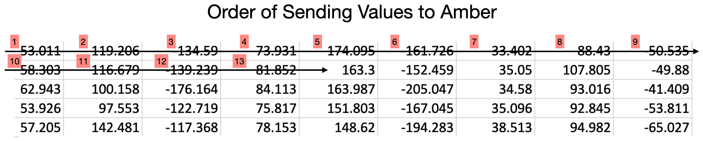</td>  
  </tr>
  <tr>
    <td><em>Figure EEE: Regardless of the length of the sensor fusion vectors values are always sent to Amber in the order shown above. Amber uses the configure number of features to know where to start the next sensor fusion vector.</em></td>
  </tr>
</table>

## Configuring Amber

Amber can be configured to monitor a wide variety of assets and processes. The asset or process being monitored determines the way that Amber should be configured. With some practice you will find ideal settings that monitor a particular asset and then those same settings can be reused again and again, as more assets come online and Amber builds a unique predictive model for each one.

### Single-Feature Versus Multi-Feature Processing

A boiler may have only a single temperature sensor that reports its temperature at any given time. A motor may have an accelerometer that gives multiple correlated values (such as X-, Y-, Z- RMS or frequency band values). An engine may have multiple accelerometers giving vibrational data at different locations. In addition, there may be control information such as motor RPM or current draw that correlates with the mode of operation of the asset. These are all examples of **features** that Amber can use to create its models. 

#### Single-Feature Processing
For some assets there may only be one feature available for processing in Amber (Figure DDD). In this case, the streaming window size becomes very important in determining the predictive model that Amber builds.  Figure FFF shows three examples.

<table class="table">
  <tr>
    <td>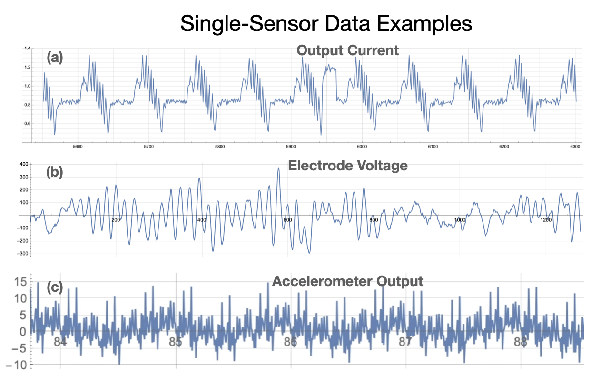</td>  
  </tr>
  <tr>
    <td><em>Figure FFF: Three examples of single sensor streaming data. (a) Output current from an industrial motor running a "bottle capping" motion profile. (b) Voltage from a single cranial electrode in an electroencephalogram (EEG). (c) Raw accelerometer output showing vibrational patterns of a motor. In each example, there is a single feature and the streaming window size determines the pattern length and the types of anomalies that will be detected (cf. Figure DDD).</em></td>
  </tr>
</table>

Let's take as an example the current draw from a motor, acquired by reading a PLC tag or by measuring voltage from a Hall sensor (Figure FFF(a)). As can be seen the large feature here is a repetitive single surge of current that spans between 25 and 50 samples. We can also see that the strange deviation from normal near 5950 spans approximately 25 samples. If the current were being sample at 10 times the rate shown here, then a streaming window size of 250 to 500 would have been desireable. This *streaming window size* determines the types of patterns learned by Amber so it should be chosen intentionally by a domain expert who understands the asset and the "size" of anomalies to be detected.

<table class="table">
  <tr>
    <td>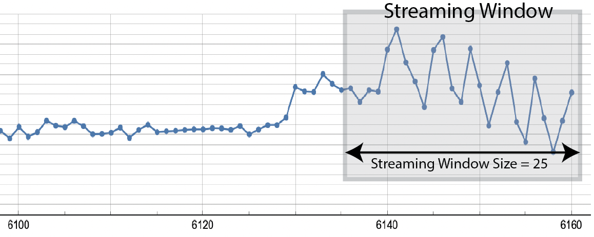</td>  
  </tr>
  <tr>
    <td><em>Figure GGG: A streaming window is a contiguous set of samples ending with the most recently acquired sample. The streaming window size shown here is 25. </em></td>
  </tr>
</table>

Once a streaming window size is chosen, then Amber will "slide it along" the incoming time series. With each incoming sample Amber processes a new streaming window ending with that new sample. Thus, successive streaming windows overlap on all but their first and last samples. Amber generates a complete set of analytic outputs for each streaming window. Because the time series of values creates each pattern that is processed by Amber, it is important that the period between samples is consistent.

#### Multi-Feature Processing
**Streaming Windows Size equal to 1:** The simplest type of multi-feature processing is with multiple features and a streaming window size of 1. In this case, each collection of features from the asset is collected at the same moment in time and assembled into a single sensor fusion vector that describes relationship between those features of the asset at that moment in time (Figure HHH).

<table class="table">
  <tr>
    <td>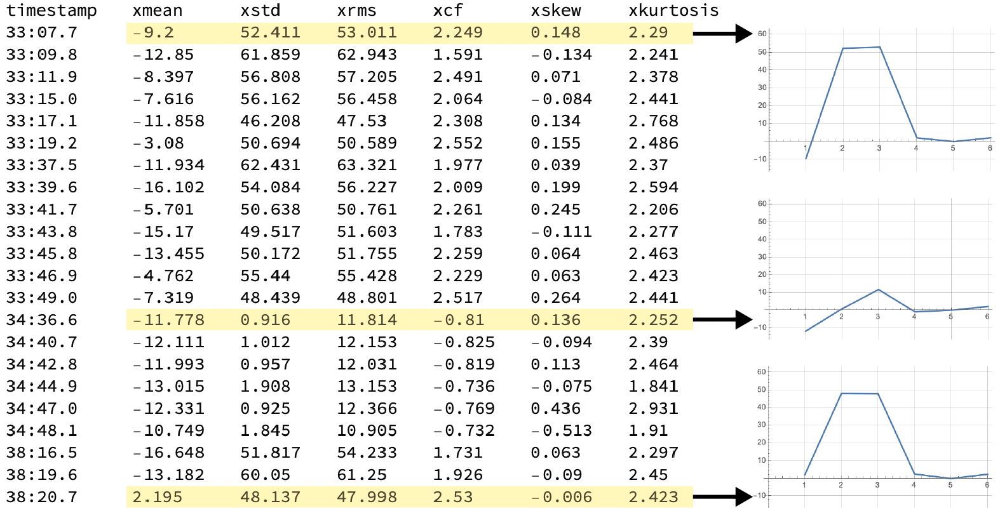</td>  
  </tr>
  <tr>
    <td><em>Figure HHH: Each row is a sensor fusion vector with 6 features that will be analyzed by Amber. Three of the sensor fusion vectors are plotted. Amber builds its models based on the relationships between measured features of the asset at each point in time. The timestamp is not part of the sensor fusion vector. </em></td>
  </tr>
</table>

It is worth noting in Figure HHH, that the period between sensor fusion vectors is not consistent. This is not a problem, since with a streaming window size is 1, there is no assumed relationship between successive sensor fusion vectors. This means that Amber is essentially doing pattern recognition, rather than time series analysis.

**Streaming Windows Size greater than 1:** While less common, there may be situations where the temporal relationship between successive sensor fusion vectors has diagnostic meaning. This would occur, for example, with a high sample rate and where the ongoing *change* in the relationships between sensor was important. In these situations, the streaming window size can be set to values larger than 1. With this configuration, Amber is doing sensor fusion analysis across a *streaming window* of successive sensor fusion vectors, and Amber becomes a powerful tool for doing multi-variate time series analysis. Because the time series of values creates the total pattern that is processed by Amber, it is important that the period between sensor fusion vectors is consistent.

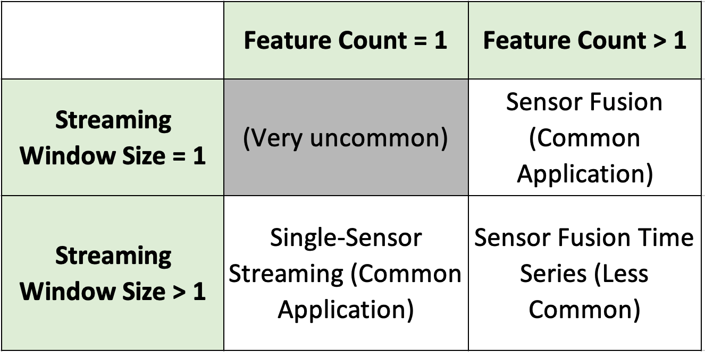

## Data Input Recommendations

### Confounding Features
It is not uncommmon for there to be sensor values streaming from an asset that can partially confound the ML model. Amber is quite tolerant of these types of features in a sensor fusion vector, but whenever possible they should be removed to provide the most relevant and representative measurements of asset states possible in training Amber.

**Constant Features** are commonly seen when an asset has a feature that never changes (e.g. a constant "1" indicating the asset is running in mode 1). They may also indicate a misconfigured sensor or a malfunctioning sensor. Amber can tolerate some of these in a sensor fusion vector although they have a roughly proportional effect in the model accuracy. For instance, if there are ten features with equal weights and one of them is constant, then when matching the pattern for that sensor there is already a 10 percent match between any two vectors in the model. If a feature is truly constant in all situations, it should not be included in the sensor fusion vector. However, if it describes something descriptive of the asset (for instance, run mode = 1, run mode = 2, etc.) then it may be desireable to include it.

**Noise in the Signal** Noise is typical in real-world sensor data and Amber accounts for this naturally in building its ML models with no loss of accuracy. In extreme cases, a misconfigured or malfunctioning sensor may be generating so much noise that the underlying signal is lost. If that feature is included in an Amber sensor fusion vector, its effect will depend on the number of other coherent features in the sensor fusion vector. If it is only one alongside, say, 10 other coherent features then Amber will still generate an accurate model of the asset. In practice, such a feature should be excluded or cleaned up to optimize the detection performance of Amber.

**Monotonic Features** A common monotonically increasing feature of many assets is "hours of operation". While this measurement is useful for preventative maintenance schedules, it is not helpful for the predictive analytics of Amber. A monotonically increasing feature in a sensor fusion vector makes it appear as if every sensor fusion vector is new, thus biasing Amber to generate anomalies. Monotonic features (whether increasing or decreasing) should not be included in sensor fusion vectors processed by Amber. 

### Redundant and Poorly Correlated Features
A typical step when using traditional anomaly detection techniques is to remove redundant and poorly correlated features. This is done to reduce the computational load in building and inferencing from the model and also to improve the accuracy of the model. For the same reason, it is typical to try to remove poorly correlated features and to include only the top, say, 10 diagnostic features out of perhaps hundreds of available asset features. This data science exercise requires many engineering hours studying covariance, principal components, training set correlations, and the like. Amber is very tolerant of redundant features and poorly correlated features. First of all, whether 10 or 100 are included in a sensor fusion vector, Amber's inference time is consistent. This means that redundant features can be included without affecting the speed of the detector. Second, Amber will use whatever information is avaiable in a poorly correlated feature to improve the accuracy of the resulting model. If it has no correlation whatsoever to the asset behavior, then it should be treated like a noise feature (described above).

### Missing Data and Variable Sample Rates
**Streaming Window Size = 1** Amber processes only numeric data. An Amber sensor fusion configuation includes the number of features, so Amber will reject incoming sensor fusion vectors with fewer than the configured number of values. Having said that, we know that certain types of sensors will fail to produce data on every sampling cycle. It is also common for sensors to produce samples at different rates. For instance, temperature sensors may be sampled very slowly and current or vibration sensors at higher sample rates (Figure III). Coping with this reality is within the scope any data analyses and not limited to Amber. However, we mention two standard approaches: *upsampling* slowly sampled features and *downsampling* features with high relative sample rates. 

<table class="table">
  <tr>
    <td>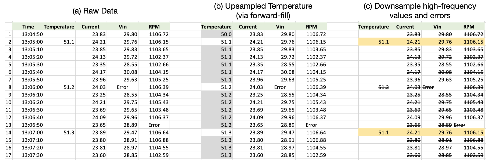</td>  
  </tr>
  <tr>
    <td><em>Figure III: (a) shows data sensor fusion vectors with variable sample rates and two errors. (b) shows one approach to upsampling temperature (foward-filling). (c) shows a downsampling approach where the sensor fusion vector are dropped where there are missing values or error values. Only the highlighted values will be sent to Amber.</em></td>
  </tr>
</table>

Upsampling can be done via forward-filling or interpolation. Upsampling slowly sampled features (Figure III(b)) is reasonable for features like temperature that change slowly. Upsampling to fill "Error" values of a quickly sampled feature is less advisable. Downsampling means dropping selected sensor fusion vectors (Figure III(c)). For example, sensor fusion vectors with sporadic error values may be dropped without significantly affecting the accuracty of the Amber model. Upsampling is generally preferable to downsampling.

**Streaming Window Size > 1**
When the streaming window size is greater than one, Amber uses the temporal relation between successive samples in building its ML model. In such situations, upsampling and downsampling are only advisable if a consistent sample period between succussive value can be maintained. The most important example of this is for single-sensor streaming where there is a one sensor producing an consistently sampled time series of values (Figure GGG). In this case, downsampling via dropping just the sporadic error values is not good practice as it changes the pattern that Amber consumes. In this scenario, some anomalies may be generated until the error/missing value is clear of the configured streaming window.

### Categorical Data
Many sensor applications will include non-numerical data that describes a *state* or *operational mode* of the asset. For instance, a string might indicate the type of material being processed ("sand", "concrete", "gravel") or it might indicate a mode of operation ("high-speed forward", "low-speed reverse"). This type of data is called *categorical* because it indicate some discrete finite set of values rather than a continuum of magnitudes. Categorical data cannot be processed directly by Amber until it has been transformed into numeric values. If there are two categories (such as "low speed" and "high speed"), they can be replaced by a 0 and 1 and Amber will be able to use them for building its model. If there are three or more categories, there may still be a reasonable way to assign an ordering to them (such as replacing "low", "medium", "high" with 0, 1, and 2). If there are more than two categories and they cannot be meaningfully ordered as magnitudes ("water", "silt", "slurry", "powder") they may still be replaced with numerical values, but the particular ordering chosen will create a slight bias in the n-space segmentation of the sensor fusion vectors as the model is built. 

# Old Stuff

## Extended Example (Allen Bradley Motors)

* **Cluster Growth**: Show cluster growth

* **Cluster ID**: Show cluster ID

* **Cluster Size**: Show cluster size histogram

* **The Anomaly Index**: Computation of the anomaly index

* **AD (Anomaly Detection)**: Anomaly threshold and detection

* **AH (Anomaly History)**: Anomaly history

* **AS (Anomaly Standard Deviation) and AW (Amber Warning Level)**: Anomaly history

* **Example 1: Single-Sensor Processing (Allen Bradley Motors)**: Rockwell data set

* **Example 2: Single-Sensor Processing (Vibrational Anomalies)**: Rockwell data set

## Examples of Patterns

* **Motor Status Tags:** Industrial motors are controlled by servo feedback loops that have multiple features. A pattern that could be used to built an ML model of motor performance date might be  
(Output Current, Torque Trim, Position, Velocity, Position Error, Velocity Error)
* **Flight Recorder Data:** An aircraft has multiple sensors that define its operating state at any point in time. For example, a pattern might have these features  
(Altitude, Air Speed, Ground Speed, Lateral Acceleration, Longitudinal Acceleration, Vertical Acceleration, Left Aileron Position, Right Aileron Position)   
* **Power Spectra:** The output of vibrational sensors is often transformed into frequency spectra. In this case, the features represent adjacent frequency bands and the value of each feature is the power from the source signal in that frequency band.
* **Triggered Impulsive Data:** If *n* consecutive samples from a single sensor are acquired like a snap shot, they can be compared by shape and clustered by similarity to gain insight about the varieties of signals occurring in the data stream. The snap shot is typically triggered by a threshold crossing of the signal.
* **Single Sensor Streaming Data:**  Consecutive overlapping windows of the most recent *n* samples from a sensor form a natural collection of *n*-dimensional vectors.
* **Histogram of Magnitudes:** This common technique from computer vision builds, for each pixel, a histogram of the grayscale values of the surrounding pixels. If values range from 0 to 255, then these patterns might have 256 featues. Then an image is transformed into a large collection of patterns (one for each pixel) that can be processed through the Boon Nano.

## Using the Boon Nano
The Boon Nano clusters its input data by assigning each pattern an integer called its **cluster ID**. Patterns assigned the same cluster ID are similar in the sense of having a small L1-distance from each other. The similarity required for patterns assigned to the same cluster is determined by the percent variation setting and the configured feature ranges (described below). Sometimes a pattern is processed by the Nano that is not similar to any of the existing clusters. In this case, one of two actions is taken. If learning mode is on and if the maximum allowed clusters has not been reached, the pattern becomes the first member of a new cluster and the number of clusters in the model increases by one. If learning mode is off or the maximum number of clusters has been reached, the pattern is assigned the special cluster ID 0. There is no assumption that can be made about the simiarity of pattern assigned to cluster 0, but they are all known to be significantly different from the non-zero clusters in the existing model.

<table class="table">
  <tr>
    <td>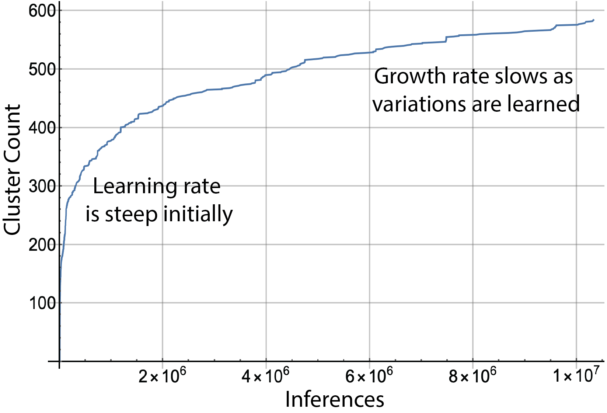</td>
  </tr>
  <tr>
    <td><em>Figure 2: The number of clusters grows quickly as the first patterns from the input data are processed. The slope of the growth curve levels off as the models matures and as nearly all incoming patterns already have a cluster to which they can be assigned.</em></td>
  </tr>
</table>

The Boon Nano is deployed in both a general-use platform called **Expert** and as a streaming sensor analytics application called **Amber**
* **Expert:** The Expert console provides the full functionality of the Boon Nano including all analytics (described below) and is oriented toward batch processing of input data.
* **Amber:** By specializing the Expert console for real-time streaming data, Amber provides an easy-to-use interface for sending streams of successive sensor values as a time series and getting back analytic values that correspond one-for-one to the sensor values. These analytic values are typically used for anomaly detection in the sensor stream.   

## Configuring the Boon Nano

### Batch Mode vs. Streaming Mode
* **clusterMode (batch or streaming):** The Boon Nano can be operated in batch mode or streaming mode depending on the application. In **batch mode**, successive patterns clustered by the Nano are not assumed to have any temporal relationship. For instance, segmentation of tissue types from a DICOM CT scan uses batch mode. Anomaly detection for quality control using camera images of standard units on a manufacturing line uses batch mode. In **streaming mode**, it assumed that successive patterns are temporally related and they typically overlap. Examples of streaming mode data would be overlapping, successive windows of single-sensor data or successive sensor fusion patterns coming off multiple related sensors in real-time. 

### Clustering Configuration
The Boon Nano uses the clustering configuration to determine the properties of the model that will be built for the input data.
* **numericType:** One numeric type is chosen to apply to all of the features in each input vector. A good default choice for numeric type is float32, which represents 32-bit, IEEE-standard, floating-point values. In some cases, all features in the input data are integers ranging from -32,768 and 32,767 (int16) or non-negative integers ranging from 0 to 65,535 (uint16), for instance, bin counts in a histogram. Using these integer types may give slightly faster inference times, however, float32 performance is usually similar to the performance for the integer types. For nearly all applications, float32 is a good general numeric type to use.
* **Feature List:** A pattern is comprised of **features** which represent the properties of each column in the vectors to be clustered. Each feature has a **range** (a min and max value) that represents the expected range of values that feature will take on in the input data. This range need not represent the entire range of the input data. For example, if the range of a feature is set to -5 to 5, then values greater than 5 will be treated as if they were 5 and value less than -5 will be treated as -5. This truncation (or outlier filtering) can be useful in some data sets. Each feature is also assigned a **weight** between 0 and 1000 which determines its relative importance in assignment of patterns into clusters. Setting all weights to 1 is a common setting, which means all features are weighted equally. Setting a weight to 0 means that feature is ignored in clustering as if it were not in the vector at all. Finally, each feature can be assigned an optional user-defined **label** (for example, "systolic", "pulse rate", "payload length", "output current"). Labels have no effect on the clustering.  
* **percentVariation:** The percent variation setting ranges from 1% to 20% and determines the degree of similarity the Nano will require between patterns assigned to the same cluster. Smaller percent variation settings create more clusters with each cluster having more similarity between patterns assigned it. A larger choice for percent variation produces coarser clustering with fewer clusters.
* **streamingWindowSize:** This indicates the number of successive samples to use in creating overlapping patterns. For instance, it is typical in single-sensor streaming mode applications to have only one feature and a streaming window size greater than 1. If there is one feature, and the streaming window size is 25, then each pattern clustered by the Nano is comprised of the most recent 25 values from the sensor. In this case, each pattern overlaps 24 samples with its predecessor. In batch mode, it is typical to use a streaming window size of 1.
<table class="table">
  <tr>
    <td>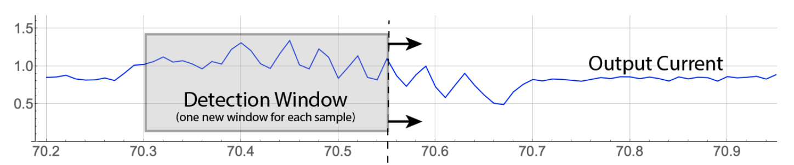</td>
  </tr>
  <tr>
    <td><em>Figure 3: One feature (all samples from the same sensor) and streaming window size of 25. Each input vector is 25 successive samples where we form successive patterns by dropping the oldest sample from the current pattern and appending the next sample from the input stream.</em></td>
  </tr>
</table>

### Autotuning Configuration
Two clustering parameters, the percent variation and the range for each feature, can be *autotuned*, that is, chosen automatically, by the Boon Nano prescanning representative data. The range for each feature can be autotuned either individually or a single range can be autotuned to apply to all features. 

One of the most difficult parameters to configure in unsupervised machine learning is the desired number of clusters needed to produce the best results (as with K-means) or (in the case of the Boon Nano) the desired percent variation to use. This is because one would not generally know *a priori* the underlying proximity structure of the input vectors to be segmented.

To address this, the Boon Nano can automatically tune its percent variation to create an balanced combination of **coherence within clusters** and **separation between clusters**. In nearly all cases, autotuning produces the best value for the percent variation setting. However, if more granularity is desired you can lower the percent variation manually. Similarly, if the autotuned percent variation is creating too much granularity (and too many clusters) then you can choose to manually increase the percent variation above the autotuned value. 

* **autotuneRange:** If this parameter is set to true, the user-supplied range(s) specified in the Nano configuration gets replaced with the autotuned range.   If set to false, the user-supplied range(s) is left intact.
* **autotunePV:** If this parameter is set to true, the user-supplied percent variation specified in the Nano configuration get replaced with the percent variation found through the autotuning. If set to false, the user-supplied percent variation is left intact.
* **autotuneByFeature:** If this is set to true and the option to autotune the range is set to true, then the autotuning will find a range customized to each feature. If false, then autotuning will find a single range that applies to all features.
* **exclusions:** An array of exclusions may be provided which causes the autotuning to ignore those features. For instance, if the array [2 7] is provided, then autotuning is applied to all features except the 2nd and 7th features. An empty exclustions array, [ ], means that no features will be excluded in the autotuning.

### Streaming Configuration (Amber Only)
Streaming parameters apply to the Amber deployment of the Boon Nano. If streaming mode is selected in the configuration, then a variety of parameters determines the analytic values returned corresponding to the sensor samples sent into Amber. In its default configuration, Amber returns one *analytic* value for each *sensor* value sent into it. The most typical analytic value is the smoothed anomaly index (SI) (described below), but other outputs can be selected. The streaming window size selected in the clustering configuration (described above) is a key parameter as it determines the amount of sensor value "history" that will be included in each pattern to be clustered.

As sensor values are streamed into it, Amber transitions automatically through four phases: starting, autotuning, learning, and monitoring.

<table class="table">
  <tr>
    <td>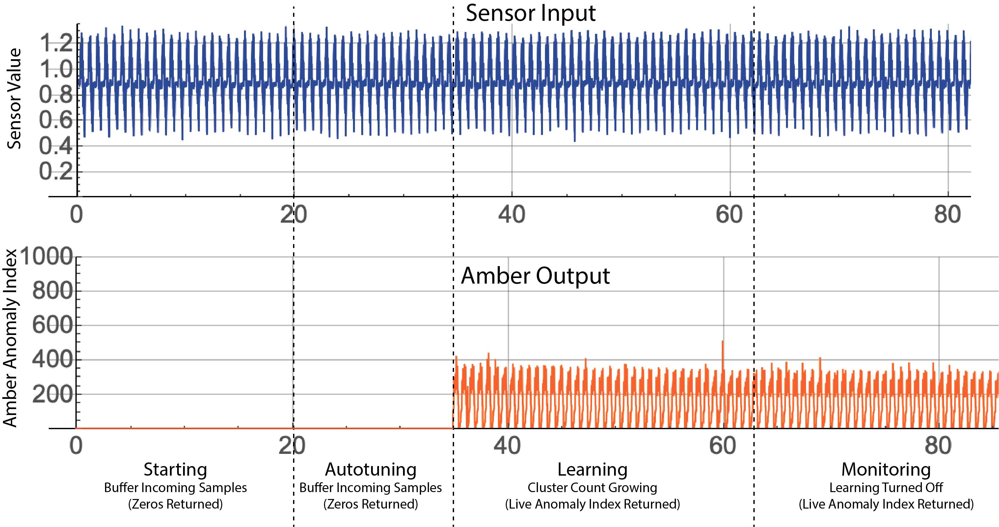</td>
  </tr>
  <tr>
    <td><em>Figure 4: The Amber application of the Boon Nano trains itself autonomously based on the real-time data it is acquiring. It builds a buffere of representative data, tunes its hyperparameters and then start segmenting and assinging anomaly indexes to each sensor sample.</em></td>
  </tr>
</table>

* **Starting:** As the first sensor samples are sent to Amber, there is not sufficient data to return meaningful analytic results. A 0 is returned as the Amber analytic for each sensor value sent. Eventually, a sufficient samples will have been acquired to move to the autotuning phase (e.g. 1000 samples may be sufficient).
* **Autotuning:** Using the autotuning configuration (described above) and the sensor samples buffered thus far, tune the Boon Nano hyperparameters (feature ranges and percent variation) to optimal values for this sensor. During autotuning, Amber continues to return zeros as the anomaly index corresponding to the incoming sensor values.
* **Learning:** Amber configures the Boon Nano with the parameters found during autotuning and then starts training the Nano with the samples that have been buffered thus far. In this phase, the Boon Nano is adding clusters as needed to build a high-dimensional analytic model that describes the sensor input and that conforms to the clustering configuration (described above). There is sufficient data in this phase to return real analytic outputs for each sensor sample sent in. Part of the streaming configuration determines when learning stops, called **graduation**. Graduation occurs automatically based on a number of graduation requirements (described below). In principle, learning can continue indefinitely, but it is usually desirable to automatically turn off learning upon graduation so that no new clusters are created. This solidifies the model so that the future analytics results retain their same meaning over many months of operation.
* **Monitoring:** The final phase of Amber is the monitoring phase where learning has been turned off. Each sensor value sent in becomes the final sample in the streaming window of prior samples. That window is clustered by the Boon Nano in real-time and the result returned as the Amber analytic value for that sample.

The streaming configuration is defined by the following parameters:
* **enableAutotuning** and **samplesToBuffer:** If enableAutotuning is set to true, then incoming sensor samples will be buffered until samplesToBuffer have been collected at which time autotuning begins on the buffered sensor data. Autotuning will typically require approximately 200 more sensor values to complete. Once autotuning is complete, then Amber uses the autotuned ranges and percent variation to configure the Nano.
* **learningGraduation:** If this is set to false, then learning continues indefinitely which means that clusters will continue to be added for patterns that cannot be placed into an existing cluster. Typically, it is set to true in which case the graduation requirements are used to automatically turn off learning if any of the graduation requirements is met.
* **learningMaxClusters (Graduation Requirement):** If during the learning phase, the Nano has a total of learningMaxClusters clusters in its model, then learning is automatically turned off.
* **learningMaxSamples (Graduation Requirement):** If during the learning phase, the Nano has processed a total of learningMaxSamples sensor samples, then learning is automatically turned off.
* **Cluster Growth Slope (Graduation Requirement):** As learning progresses, clusters are added. As the model matures, the growth in the cluster count slows as the Nano has created clusters that account for nearly all of the variation in the input data. The ratio learningRateNumerator divided by learningRateDenominator determines a cluster growth "flatness" threshold. If during the most recent learningRateDenominator inferences, there have been fewer than learningRateNumerator new clusters created, then learning is automatically turned off.

## Clustering Results

When a single pattern is assigned an cluster ID, this is called an *inference*. Besides its cluster ID, a number of other useful analytic outputs are generated. 

### Cluster ID (ID)
The Boon Nano assigns a **Cluster ID** to each input vector as they are processed. The first vector is always assigned to a new cluster ID of 1. The next vector, if it is within the defined percent variation of cluster 1, is also assigned to cluster 1. Otherwise it is assigned to a new cluster 2. Continuing this way all vectors are assigned cluster IDs in such a way that each vector in each cluster is within the desired percent variation of that cluster's template. In some circumstances the cluster ID 0 may be assigned to a pattern. This happens, for example, if learning has been turned off or if the maximum cluster count has been reached. It should be noted that cluster IDs are assigned serially so having similar cluster IDs (for instance, 17 and 18) says nothing about the similarity of those clusters. However, PCA can be used to measure relative proximity of clusters to each other.

### Raw Anomaly Index (RI)
The Boon Nano assigns to each pattern a **Raw Anomaly Index**, that indicates how many patterns are in its cluster relative to other clusters. These integer values range from 0 to 1000 where values close to zero signify patterns that are the most common and happen very frequently. Values close to 1000 are very infrequent and are considered more anomalous the closer the values get to 1000. Patterns with cluster ID of 0 have a raw anomaly index of 1000.

### Smoothed Anomaly Index (SI)
Building on the raw anomaly index, we create a **Smoothed Anomaly Index** which is an edge-preserving, exponential, smoothing filter applied to the raw anomaly indexes of successive input patterns. These values are also integer values ranging from 0 to 1000 with similar meanings as the raw anomaly index. In cases where successive input patterns do not indicate any temporal or local proximity, this smoothing may not be meaningful.

<table class="table">
  <tr>
    <td>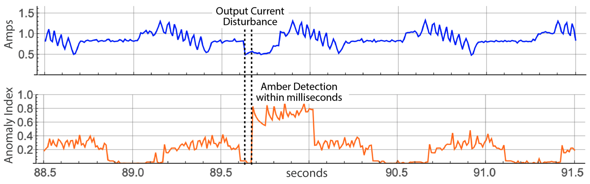</td>
  </tr>
  <tr>
    <td><em>Figure 5: Raw sensor signal (Blue) and SI, the Smoothed Anomaly Index (Amber), showing a rarely occuring pattern in the sensor stream model.</em></td>
  </tr>
</table>   

### Frequency Index (FI)
Similar to the anomaly indexes, the **Frequency Index** measures the relative number of patterns placed in each cluster. The frequency index measures all cluster sizes relative to the average size cluster. Values equal to 1000 occur about equally often, neither abnormally frequent or infrequent. Values close to 0 are abnormally infrequent, and values significantly above 1000 are abnormally frequent.

### Distance Index (DI)
The **Distance Index** measures the distance of each cluster template to the centroid of all of the cluster templates. This overall centroid is used as the reference point for this measurement. The values range from 0 to 1000 indicating that distance with indexes close to 1000 as indicating patterns furthest from the center and values close to 0 are very close. Patterns in a space that are similar distances apart have values that are close to the average distance between all clusters to the centroid.

## Nano Status
Whereas Nano Results (above) give specific analytic results for the patterns in the most recently processed sample buffer, **Nano Status** provides core analytics about the Nano itself and the current machine learning model that has been constructed since it was configured. The results are indexed by cluster ID beginning with cluster 0. 

### clusterSizes
In learning mode, the values in this list give the number of patterns that have been assigned to each cluster beginning with cluster 0. When learning is turned off, this value does not change.

### anomalyIndexes 
The values in this list give raw anomaly index (RI) for each cluster in the Nano's current model.  The cluster assigned the most patterns has anomaly index of 0 up to a maximum of 1000 for a cluster that has only been assigned one pattern. Cluster 0 always has anomaly index of 1000.

### frequencyIndexes
Similar to the anomaly indexes, each value in this list gives the frequency index associated with the corresponding cluster whose ID beginning with cluster 0. These values are integers that range from 0 and up. While there is no definitive upper bound, each Nano model will have a local upper bound. Values below 1000 indicate clusters whose sizes are smaller than average, where 0 is the most common cluster size. Values above 1000 have been assigned more patterns than average and the further they are above 1000, the larger the cluster is. This statistic is a dual use value where anomalies (very small and very large) can be considered when they have values on either side of 1000.

### distanceIndexes
Distance indexes refer to each cluster's spatial relation to the other clusters. Values close to 1000 are very far away from the natural centroid of all of the clusters. Values close to 0 are located near the center of all the clusters. On average, these values don't vary much and develop a natural mean. This is also a dual threshold statistic since the natural mean represents the typical spacing of the clusters and there can be abnormally close clusters and abnormally distant clusters.

### clusterGrowth
The cluster growth curve shows the number of inferences between the creation of each new cluster (Figure 2). The list returned by clusterGrowth is the indexed pattern numbers where a new cluster was created which can be used as the x-values of this curve. The y-values can be derived as an ascending sequence of cluster IDs: 0, 1, 2, 3, etc. For instance, if clusterGrowth returns [0 1 5 7 20], the coordinates of the cluster growth plot would be: [0 0], [1 1], [5 2], [7 3] [20 4].

### PCA
Clusters in the Boon Nano are naturally mapped into a very high-dimensional space. This makes it difficult to meaningfully visualize the clusters on a two- or three-dimensional plot. The Nano's PCA list is similar to traditional principal component analysis in the sense it can be used to remap a high-dimensional vector into a lower dimensional space that, as far as possible, preserves distances and limits the flattening effects of projection. The PCA coordinates can be used, for example, to assign RGB values to assign a meaningful color to each cluster. Clusters with different but similar colors are from clusters whose assigned patterns are different enough to be in distinct clusters but that are still close to each relative to the other clusters in the model. The zero cluster is always the first value in the list of PCA values and is always represented by [0, 0, 0].

<table class="table">
  <tr>
    <td>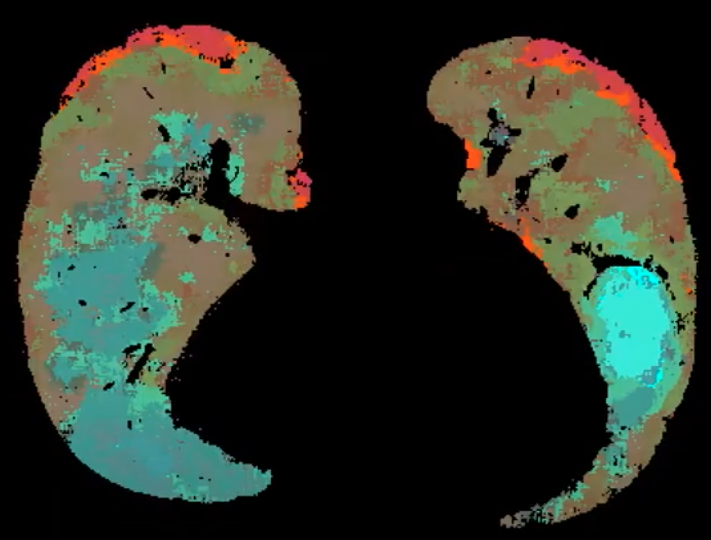</td>
  </tr>
  <tr>
    <td><em>Figure 6: Pulmonary CT image using PCA coloring to show distinct tissue textures and the gradients between them.</em></td>
  </tr>
</table>   

### numClusters
This is a single value that is the current number of clusters in the model including cluster 0. This value should equal the length of the lists: PCA, clusterSizes, anomalyIndexes, frequencyIndexes, distanceIndexes, clusterGrowth.

### totalInferences
This is the total number of patterns successfully clustered. The total of all the values in clusterSizes should also equal this value.

### averageInferenceTime
The value returned here is the average time to cluster each inference in microseconds.  
 
## Example
We now present a very simple example to illustrate some of these ideas. A set of 48 patterns is shown in the figure below. A quick look across these indicates that there are at least two different clusters here. Each pattern has 16 features so we configure the Nano for
* Numeric Type of float32
* Pattern Length of 16

<table class="table">
  <tr>
    <td>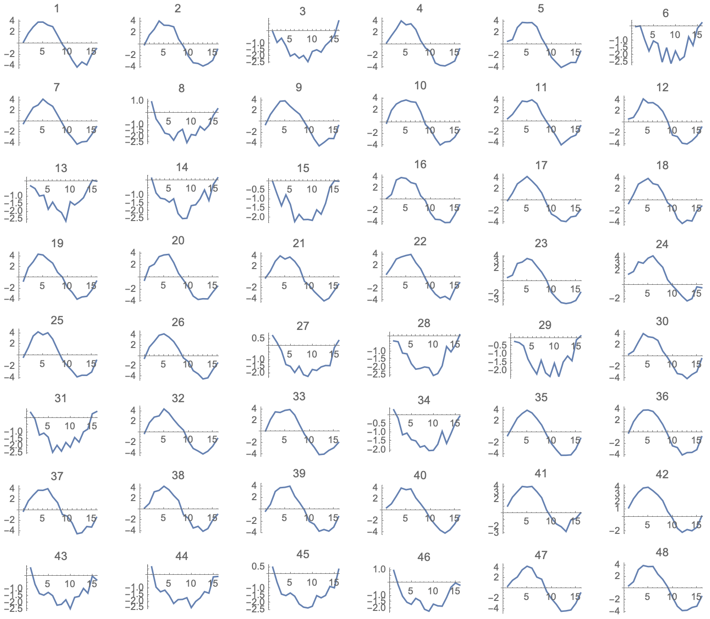</td>
  </tr>
  <tr>
    <td><em>Figure 7: A collection of 48 16-dimensional vectors to be clustered</em></td>
  </tr>
</table>   

We could select the mininum and maximum by visual inspection, but it is not possible to determine the correct Percent Variation this way. So we instead load the patterns into the Nano and tell the Nano to Autotune those parameters. The results comes back with 
* Min = -4.39421
* Max = 4.34271
* Percent Variation = 0.073

We configure the Nano with these parameters and then run the patterns through the Nano, requesting as a result the "ID" assigned to each input pattern. We receive back the following list: {1, 1, 2, 1, 1, 2, 1, 2, 1, 1, 1, 1, 2, 2, 2, 1, 1, 1, 1, 1, 1, 1, 1, 3, 1, 1, 2, 2, 2, 1, 2, 1, 1, 2, 1, 1, 1, 1, 1, 1, 3, 3, 2, 2, 2, 2, 1, 1}
 
 Comparing this to the sequence in the figure, we see that this is a reasonable clustering assignment. Further, we see that there is a third cluster that may have been missed by our intuitive clustring. This cluster had just three patterns assigned to it. The figure below shows the waveforms plotted on the same axes and colored according according to their assigned cluster IDs. 
 
 <table class="table">
  <tr>
    <td>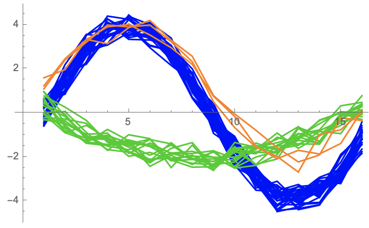</td>
  </tr>
  <tr>
    <td><em>Figure 8: 48 patterns colored according to their assigned clusters</em></td>
  </tr>
</table>  
 
The Raw Anomaly index for each of the three clusters are as follows:
* Cluster 1 Raw Anomaly Index: 0
* Cluster 2 Raw Anomaly Index: 170
* Cluster 3 Raw Anomaly Index: 563

This indicates Cluster 1 had the most patterns assigneed to it. Cluster 2 was also common, and Cluster 3 was significantly less common. It is worth noting that a Raw Anomaly Index of 563 would not be sufficient in practice to indicate an anomaly in the machine learning model. Typically, useful anomaly indexes must be in the range of 700 to 1000 to indicate a pattern that is far outside the norm of what has been learned.

**Important Simplifications:** This is an artificially small and simple example to illustrate the meaning of some of the basic principles of using the Boon Nano. In particular, 
* The Boon Nano is typically be used to cluster millions or billions of patterns.
* The number of clusters created from "real" data typically runs into the hundreds or even thousands of clusters. 
* The speed of the Boon Nano for such a small data set is not noticeable over other clustering techniques such as K-means. However, when the input set contains 100s of millions of input vectors or when the clustering engine must run at sustained rates of 100s of thousands of inferences per second (as with video or streaming sensor data), the Boon Nano's microsecond inference speed makes it the only feasible technology for these kinds of solutions.
