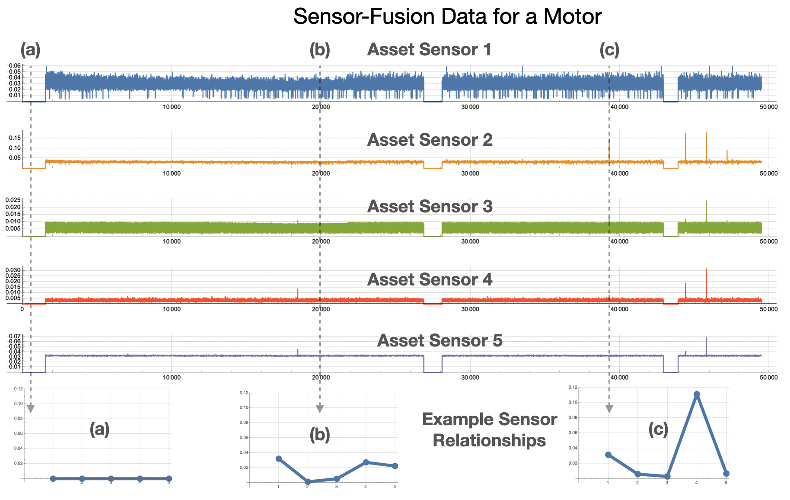
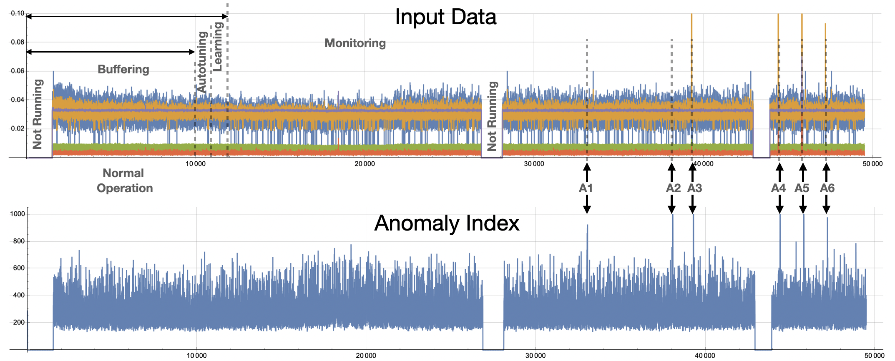

   
# Example: Anomaly Detection in a Multi-Sensor Asset

## Introduction

One the most powerful capabilities of Amber can be seen when it processes sensor fusion vectors streaming from a multi-sensor asset. Traditional anomaly detection approach look for min/max excursions of individual sensors beyond some statistically defined normal range. What happens if each individual sensor with within the statistical limits of its normal operation, but there is a *relational anomaly* between sensors? The machine learning model that Amber builds captures both the normal individual sensor behavior and the complex variations in the relationship between sensors at the same moment in time. 

<table class="table">
  <tr>
    <td></td>
  </tr>
  <tr>
    <td><em>Figure AAA: Examples of sensor relationships for a motor asset. (a) shows a normal state of "Not running" for the asset. (b) and (c) show other relationships between sensors.</em></td>
  </tr>
</table>

Imagine, for example, that a motor is rotating at 2000 RPM and in this mode of operation there is a corresponding current draw and vibrational frequency spectrum. This complex relationship between sensor values is captured by Amber. In another operating state, the motor might be rotating at 3000 RPM with a different corresponding current draw and frequency spectrum. There will also be many complex relational variations as the motor speed increases from 2000 to 3000 and back again. Amber integrates all of these normal relational variations into its high-dimensional model during training. Now suppose the motor is operating in the Amber monitoring state and is running at 2000 RPM but with a current draw that was only seen during training when the motor was running at 3000 RPM. This type of *relational anomaly* cannot be captured by traditional anomaly detection approaches, but it certainly may indicate a change in the asset indicating a trajectory toward eventual failure. Similiary, subtle variations in the frequency spectra may indicate changing asset performance long before an operator can hear or feel any change. This is the power of Amber's machine learning based predictive analytics model.

## Data Set
Figure AAA shows data collected from a pump asset with multiple sensors. The particular sensors in the sensor fusion vector might measure vibration, current, pressure, temperature, humidity, torque, etc. Figure BBB shows the data from Figure AAA on a single plot. We train on the first 10,000 samples and after Autotuning and Learning we enter the Monitoring state.

<a href="AmberDemo_Data.csv" download>Download Data Set</a>

<table class="table">
  <tr>
    <td></td>
  </tr>
  <tr>
    <td><em>Figure BBB: Six anomalies in the data are shown as A1 through A6. A3 through A6 are anomalies that can be detected using traditional techniques. Anomalies A1 and A2 are relational anomalies only visible to Amber's high-dimensional model.    </em></td>
  </tr>
</table>

## Amber Configuration
To get these results, we configure Amber with following settings

* Feature Count: 5
* Streaming Window Size: 1
* Samples to Buffer: 10000
* Learning Rate Max Clusters: 1000
* Learning Rate Max Samples: 1000000
* Learning Rate Numerator: 10
* Learning Rate Denominator: 10000

The Feature Count is set to 5 since there are 5 features in each sensor fusion vectors. Setting the Streaming Window Size to 1 means that each sensor fusion vector is considered on its own and not in relation the preceding sensor fusion vectors. Samples to Buffer is set to 10,000 since, for this data set, 10,000 sample is enough to capture both the normal "Not Running" state and the normal running states for this asset. Setting the Learning Rate Numerator and Denominator means that Amber will switch automatically from Learning to Monitoring when over 10,000 sample there is at most an increase of 10 new clusters.

## Amber Results
Using the data set provided and the Amber configuration above, you should get results for the Anomaly Index (SI) that look as shown in Figure BBB. The complete set of Amber results are in this file.
 
<a href="AmberDemo_Results.csv" download>Download Amber Results</a>

