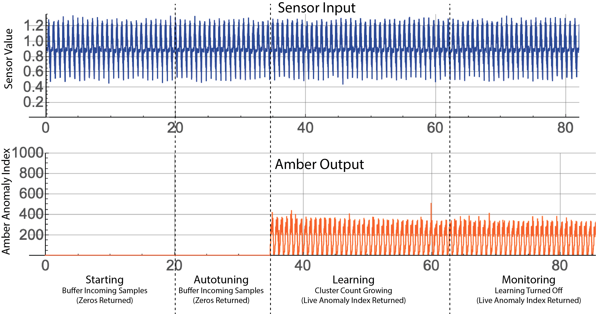
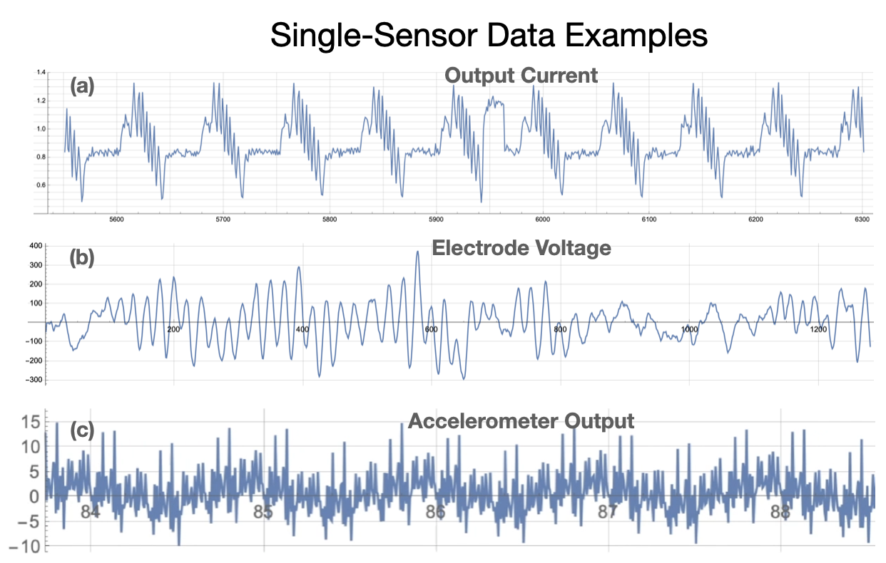

   
## Introduction to Amber
Amber is a real-time, predictive analytics platform that uses unsupervised machine learning to build high-dimensional models that are individualized to each asset being monitored. Typical assets include include pumps, generators, engines, boilers, etc. However, an **asset** can be broadly defined as any entity with *correlated* measurements that define its operating state. With this definition we can broaden our list of assets.

* Motors, pumps, generators: correlated vibration (FFTs for instance), current, voltage, temperature
* Production processes: correlated assets in a production process, rejects per minute, average pH, airflow, robotic motion profiles, etc.
* Biological processes: correlated biomarkers such as multielectrode EEGs, ECG measurements, blood-pressure, temperature
* Network traffic: TCP packet header fields and correlated traffic in network conversations
* Video streams: correlated features within each frame and also the time series correlation across successive frames

## Operational Overview

### Amber Training Phases

* **User Configuration:** Amber begins with a domain expert for the asset determining which asset sensor values will be used by Amber to monitor its operation (Figure 1).

<table class="table">
  <tr>
    <td></td>
  </tr>
  <tr>
    <td><em>Figure 1: The operational stages of Amber beginning with the domain expert determining which asset sensor values will be used as input to Amber. As more and more asset data is fed into Amber, it automatically transitions through training and into monitoring mode.</em></td>
  </tr>
</table>

As asset data is streamed into Amber, Amber transitions *automatically* through four phases: buffering, autotuning, learning, and monitoring.

* **Buffering:** As the first asset samples are sent to Amber, there is not sufficient data to return meaningful analytic results so a 0 is returned as the analytic output for each sensor value sent. Eventually, sufficient samples have been acquired and Amber transitions automatically to its autotuning mode.
* **Autotuning:** In the autotuning phase, the Amber hyperparameters are tuned to optimal values for this asset as data continues to flow in. During autotuning, Amber continues to return zeros as the analytic output response to the incoming sensor values. Once autotuning is complete, the optimal hyperparamters values are set within Amber, and it transitions automatically to learning mode.
* **Learning:** Amber starts by learning from the asset samples that have already been buffered. In learning mode, Amber adds clusters as needed to build a high-dimensional analytic model that describes the normal variation in the sensor input (Figure 2). In addition, Amber learns the normal background level of anomalies for the asset as many complex assets show some anomalies, even in their compliant state. While the Amber model is still being built, it is mature enough to return limited analytic results for each sensor sample sent in. In principle, learning can continue indefinitely, but it is usually desirable to automatically turn off learning upon graduation so that no new clusters are created. This solidifies the model so that the future analytics results retain their same meaning over many months of operation. When learning is complete, Amber automatically transitions to monitoring mode.

<table class="table">
  <tr>
    <td></td>
  </tr>
  <tr>
    <td><em>Figure 2: The horizontal axis of the Amber Learning Curve shows the number of asset values that have been sent to Amber. The vertical axis shows the number of clusters in the model. Notice that as more asset data is provided to Amber the learning slows and eventually levels off.</em></td>
  </tr>
</table>

* **Monitoring:** The final phase of Amber is monitoring. In Monitoring mode, the Amber model customized for the asset is complete and Amber learning is turned off. Asset data sent into Amber is processed through the asset model, and the full Amber analytic results corresponding to the incoming asset data are returned in real-time.

### Amber Training Example
Figure 3 shows an example of Amber training for a motor asset. Five features were chosen by the subject matter expert for this motor to represent its operational states (more detail is given in [this example](SensorFusionExample/SensorFusionExample.md)). From sample 1 through 10,000 we see the Amber Buffering stage described above. Nothing is happening inside of Amber during this period except that Amber is collecting the asset samples and waiting until the configured number of samples has been acquired. (More detail on configuration of Amber and Amber training is included below.) 

<table class="table">
  <tr>
    <td></td>
  </tr>
  <tr>
    <td><em>Figure 3: Example showing Amber training phases for a motor asset. The sensor fusion vector has 5 features which are superimposed on this plot.</em></td>
  </tr>
</table>

After the 10,000th sample has been acquired Amber begins a search for optimal hyperparamaters that will determine the dimensionality and granularity of the model that will be created in the next phase (Learning). While Amber is searching for those hyperparameters, it continues to buffer data as it is fed in. Once they are found, Amber and configures itself to begin the Learning phase where it will build its model of normal variation for this particular asset. Amber primes the learning by using the data from the Buffering stage to build a model up to and through all of the samples that have been acquired from the asset thus far. When the Learning Curve (Figure 2) is sufficiently flat, Amber declares that the model is mature enough to transition to the long-term monitoring stage. At this point the model does not change and the anomaly detector is ready for operation.

Figure 4 shows an example of Amber training on single-sensor. For this example, we also show one of the outputs of Amber (SI, the smoothed anomaly index) that gets returned. Each sensor sample sent into Amber receives a single Amber SI analytic result in that corresponds to it. As shown, during the Buffering and Autotuning phases the value 0 is returned since the hyperparameters of Amber have not yet been set.

<table class="table">
  <tr>
    <td></td>
  </tr>
  <tr>
    <td><em>Figure 4: Amber training showing single-sensor input and the corresponding Amber output for the SI (Anomaly Index) output. Note that zero is returned as the analytic result until autotuning is complete. </em></td>
  </tr>
</table>

## Definitions and Terminology

Amber consumes sensor data values as it builds its machine learning models and monitors assets and processes. Values are sent to Amber as comma-separated values (CSV) and support I8 32-bit floating-point range and precision. Many assets to be monitored have several values that can be sampled at the same moment in time thereby creating a "snapshot" of the state of that asset at that moment. By assembling these measurements into a single vector (a sequence of comma-separated values), we create a **sensor fusion** vector for that asset at that moment in time (Figure 5). In some cases, the temporal sequence of sensor fusion vectors may have predictive value in describing normal operation of the asset. In this case, the **streaming window size** parameter creates a multivariate time series that will be learned and monitored by Amber (Figures 5 and 6). In this case, we define a **pattern** as that time series of sensor fusion vectors. Note that patterns *overlap* temporally adjacent sensor fusion vectors with a new pattern being created by each newly arriving sensor fusion vector. 

<table class="table">
  <tr>
    <td></td>
  </tr>
  <tr>
    <td><em>Figure 5: Basic definitions for understanding Amber input data.</em></td>
  </tr>
</table>

<table class="table">
  <tr>
    <td></td>
  </tr>
  <tr>
    <td><em>Figure 6: Amber processes overlapping patterns moving forward in the data stream one sensor fusion vector at a time. Each pattern is assigned a cluster ID, and anomaly index and several other ML-based values.</em></td>
  </tr>
</table>

<table class="table">
  <tr>
    <td></td>
  </tr>
  <tr>
    <td><em>Figure 7: The pattern length is the product of the number of features (in each sensor fusion vector) times the streaming window size.</em></td>
  </tr>
</table>

One special case is the *single-sensor* time series where there is only one feature in the sensor fusion vector (Figure 8) and the streaming window size defines the pattern that is consumed by Amber. Details and examples for configuring these parameters of Amber is provided [below](#Pattern_Configuration).

<table class="table">
  <tr>
    <td></td>
  </tr>
  <tr>
    <td><em>Figure 8: A one-dimensional time series can be processed by configuring Amber with only one feature and with a streaming window size equal to the number of successive values from the sensor to be processed as one pattern. Each successive value only needs to be sent one time. Amber manages the overlapping of the streaming window.</em></td>
  </tr>
</table>

The order of sending values to Amber is a simple, comma-separated sequence as shown in Figure 9. Amber will have already been configured to know the length of each sensor fusion vector so there is no need delimit sensor fusion vectors, however, it is important that there are no missing values and that every feature in each sensor fusion vector is sent to retain parity as Amber parses the incoming stream of values. 

<table class="table">
  <tr>
    <td></td>  
  </tr>
  <tr>
    <td><em>Figure 9: Regardless of the length of the sensor fusion vectors, values are always sent to Amber in the order shown above. Amber uses the configured number of features to know where to start the next sensor fusion vector.</em></td>
  </tr>
</table>

## Configuring Amber

Amber can be configured to monitor a wide variety of assets and processes. The asset or process being monitored determines the way that Amber should be configured. With some practice, you will find ideal settings that monitor a particular asset and then those same settings can be reused again and again, as more assets come online and Amber builds a unique predictive model for each one.

### Single-Feature Versus Multi-Feature Processing

A boiler may have only a single temperature sensor that reports its temperature at any given time. A motor may have an accelerometer that gives multiple correlated values (such as X-, Y-, Z- RMS or frequency band values). An engine may have multiple accelerometers giving vibrational data at different locations. In addition, there may be control information such as motor RPM or current draw that correlates with the mode of operation of the asset. These are all examples of **features** that Amber can use to create its models. 

#### Single-Feature Processing
For some assets there may only be one feature available for processing in Amber (Figure 8). In this case, the streaming window size becomes very important in determining the predictive model that Amber builds.  Figure 10 shows three examples.

<table class="table">
  <tr>
    <td></td>  
  </tr>
  <tr>
    <td><em>Figure 10: Three examples of single sensor streaming data. (a) Output current from an industrial motor running a "bottle capping" motion profile. (b) Voltage from a single cranial electrode in an electroencephalogram (EEG). (c) Raw accelerometer output showing vibrational patterns of a motor. In each example, there is a single feature and the streaming window size determines the pattern length and the types of anomalies that will be detected (cf. Figure 8).</em></td>
  </tr>
</table>

Let's take as an example the current draw from a motor, acquired by reading a PLC tag or by measuring voltage from a Hall sensor (Figure 10(a)). As can be seen the large feature here is a repetitive single surge of current that spans between 25 and 50 samples. We can also see that the strange pattern deviation near 5950 spans approximately 25 samples. If the signal were being sampled at 10 times the rate shown here, then a streaming window size of 250 to 500 would have been desireable. This *streaming window size* determines the types of patterns learned by Amber so it should be chosen intentionally by a domain expert who understands the asset and the "size" of anomalies to be detected (Figure 11).

<table class="table">
  <tr>
    <td></td>  
  </tr>
  <tr>
    <td><em>Figure 11: A streaming window is a contiguous set of samples ending with the most recently acquired sample. The streaming window size shown here is 25. </em></td>
  </tr>
</table>

Once a streaming window size is chosen, then Amber will "slide" the window along the incoming time series. With each incoming sample, Amber processes a new streaming window ending with that new sample. Thus, successive streaming windows overlap on all but their first and last samples. For each streaming window, Amber generates a complete set of analytic outputs. Because the time series determines each pattern that is processed by Amber, it is important that the period between samples is consistent.

#### Multi-Feature Processing (Sensor Fusion)
**Streaming Windows Size equal to 1:** The simplest type of multi-feature processing is with a streaming window size of 1. In this case, each collection of features from the asset is collected at the same moment in time and assembled into a single sensor fusion vector that describes relationship between those asset features at that moment in time (Figure 12).

<table class="table">
  <tr>
    <td></td>  
  </tr>
  <tr>
    <td><em>Figure 12: Each row is a sensor fusion vector with 6 features that will be analyzed by Amber. The three highlighted sensor fusion vectors are plotted at the right. Amber builds its models based on the relationships between measured features of the asset at each point in time. The timestamp is not part of the sensor fusion vector. </em></td>
  </tr>
</table>

It is worth noting in Figure 12, that the period between sensor fusion vectors is not consistent. This is not a problem, since with a streaming window size is 1, there is no assumed temporal relationship between successive sensor fusion vectors. This means that Amber is essentially doing pattern recognition, rather than time series analysis.

**Streaming Windows Size greater than 1:** While less common, there may be situations where the temporal relationship between successive sensor fusion vectors has diagnostic meaning. This would occur, for example, with a high sample rate and where the ongoing *change* in the relationships between sensor was important. In these situations, the streaming window size can be set to values larger than 1. With a streaming window size greater than 1, Amber is doing sensor fusion analysis across a *streaming window* of successive sensor fusion vectors, and Amber becomes a powerful tool for doing multi-variate time series analysis. Because the time series of values creates the total pattern that is processed by Amber, it is important that the period between sensor fusion vectors is consistent.

### Configuration Parameters
The following parameters determine the way that Amber will ingest data and how it will transition between its training phases (Figure 1). Along with the definition, some recommendations are given for how to set these values.

* **featureCount** The number of features in each sensor fusion vector. This is set by the domain expert as they determine the asset features that will be used to train Amber (Figure 5).
* **streamingWindowSize:** The number of successive samples to use in creating overlapping patterns (Figure 6 and 7). Recommendations for this parameters are given in the previous section.
* **samplesToBuffer:** Incoming sensor samples will be buffered until this number of asset samples has been collected at which time autotuning begins on the buffered sensor data. Autotuning will typically require up to 200 additional sensor values to run to completion, as it uses each batch of asset samples to increment its internal search algorithm. Once autotuning is complete, Amber uses the autotuned ranges and percent variation to set its hyperparameters (Figure 1). The value chosen for samplesToBuffer should be large enough to give Amber a representative block of data representing normal operation of the asset. (See [Amber Training Recommendations](#Training_Recommendations) below). 
* **anomalyHistoryWindow:** Every incoming dataset or sensor has a normal amount of anomalous behavior. This normaly amount of variations are taken into account when calculating the AH, AM, and AW output values. These values learn a normal amount of detections within a given window of time so that when in monitoring, the variation of the sensors and datasets are accounted for. AnomalyHistoryWindow gives the number of samples to use as the window for determining that normal amount of anomalies. This value should be decently large so that the variation can occur normally. For example, with sampling every minute, an anomalyHistoryWindow of 10,000 would learn what is a normal count of anomalies within the last week. (See [Amber Training Recommendations](#Anomalies_During_Training) below).
* **learningMaxClusters (graduation requirement):** If during the Learning phase, Amber reaches  learningMaxClusters clusters in its model (the vertical axis of Figure 2), then learning is automatically turned off and Amber transitions to Monitoring mode. The default value of 1000 clusters is a reasonable upper bound for even very complex assets.
* **learningMaxSamples (graduation requirement):** If during the learning phase, the asset has sent at least learningMaxSamples samples (the horizontal axis of Figure 2), then learning is automatically turned off and Amber transitions to monitoring mode. This parameter can be used to force learning to stop after some number of samples from the asset. This should generally be set to a very large value like one million in order to let Amber determine the end of learning from the Learning Curve slope.
* **learningRateNumerator** and **learningRateDenominator (graduation requirements):** As learning progresses, clusters are added to Amber's customizes model of the asset. As the model matures, the growth in the cluster count slows as Amber has created enough clusters to account for nearly all of the variation in the input data. The ratio learningRateNumerator divided by learningRateDenominator determines a Learning Curve slope "flatness" threshold (Figure 2). If during the most recent learningRateDenominator inferences, there have been fewer than learningRateNumerator new clusters created, then learning is automatically turned off. A reasonable value for these two values is 10 and 10,000 which means that in 10,000 asset samples, there have been fewer than 10 new clusters created.

## Amber Data Input Recommendations

### Confounding Features
It is not uncommmon for there to be sensor values streaming from an asset that can partially confound the ML model. Amber is quite tolerant of these types of features in a sensor fusion vector, but whenever possible they should be removed to provide the most relevant and representative measurements of asset states possible in training Amber.

**Constant Features** are commonly seen when an asset has a feature that never changes (e.g. a constant "1" indicating the asset is running in mode 1). However, a constant sensor output may also indicate a misconfigured or malfunctioning sensor. Amber can tolerate some of these in a sensor fusion vector although they have a roughly proportional negative effect in the model accuracy. For instance, if there are ten features with equal weights and one of them is constant, then when matching the pattern for that sensor there is already a 10 percent match between any two vectors in the model. If a feature is truly constant in all situations, it should not be included in the sensor fusion vector. However, if it describes something descriptive of the asset (for instance, run mode = 1, run mode = 2, etc.) then it may be desireable to include it.

**Noise in the Signal** Noise is typical in real-world sensor data and Amber accounts for this naturally when building its ML models with no loss of accuracy. In extreme cases, a misconfigured or malfunctioning sensor may be generating so much noise that the underlying signal is lost. If that feature is included in an Amber sensor fusion vector, its effect will depend on the number of other coherent features in the sensor fusion vector. If it is only one alongside, say, 10 other coherent features then Amber will still generate an accurate model of the asset. In practice, such a feature should be excluded or cleaned up to optimize the detection performance of Amber.

**Monotonic Features** A common monotonically increasing feature of many assets is "hours of operation". While this measurement is useful for preventative maintenance schedules, it is not helpful for the predictive analytics of Amber. A monotonically increasing feature in a sensor fusion vector makes it appear as if every sensor fusion vector is new, thus biasing Amber to generate anomalies. Monotonic features (whether increasing or decreasing) should not be included in sensor fusion vectors processed by Amber. 

### Redundant and Poorly Correlated Features
A typical technique when using traditional anomaly detection methods is to remove redundant features and poorly correlated features. This is done to reduce the computational load in building and inferencing from the model and also to improve the accuracy of the model. It is typical to try to remove poorly correlated features and to include only the top 10 or so diagnostic features out of perhaps hundreds of available asset features. This data science exercise requires many engineering hours studying covariance, principal components, training set correlations, and the like. Amber is very tolerant of redundant features and poorly correlated features. First of all, whether 10 or 100 are included in a sensor fusion vector, Amber's inference time is consistent. This means that redundant features can be included without affecting the speed of the detector. Second, Amber will use whatever information is avaiable in a poorly correlated feature to improve the accuracy of the resulting model. If a feature has no correlation whatsoever to the asset behavior, then it should be treated like a noise feature (described above).

### Missing Data and Variable Sample Rates
**Streaming Window Size = 1** Amber processes only numeric data. An Amber sensor fusion configuation includes the number of features, so Amber will reject incoming sensor fusion vectors with fewer than the configured number of values. Having said that, we know that certain types of sensors will fail to produce data on every sampling cycle. It is also common for sensors to produce samples at different rates. For instance, temperature sensors may be sampled very slowly and vibration sensors at higher sample rates (Figure 13). Coping with this reality is within the scope of any data analysis exercise and is not limited to Amber. However, we mention two standard approaches: *upsampling* slowly sampled features and *downsampling* features with high relative sample rates. 

<table class="table">
  <tr>
    <td></td>  
  </tr>
  <tr>
    <td><em>Figure 13: (a) shows data sensor fusion vectors with variable sample rates and two errors. (b) shows one approach to upsampling temperature (foward-filling). (c) shows a downsampling approach where the sensor fusion vector with missing values or error values are dropped. Only the highlighted values will be sent to Amber.</em></td>
  </tr>
</table>

Upsampling can be done via forward-filling or interpolation. Upsampling slowly sampled features (Figure 13(b)) is reasonable for features like temperature that change slowly. Upsampling to fill "Error" values of a quickly sampled feature is less advisable. Downsampling means dropping selected sensor fusion vectors (Figure 13(c)). For example, sensor fusion vectors with sporadic error values may be dropped without significantly affecting the accuracy of the Amber model. Upsampling is generally preferable to downsampling.

**Streaming Window Size > 1**
When the streaming window size is greater than one, Amber uses the temporal relation between successive samples in building its ML model. In such situations, upsampling and downsampling are only advisable if a consistent sample period between succussive value can be maintained. The most important example of this is for single-sensor streaming where there is one sensor producing a consistently sampled time series of values (Figure 11). In this case, downsampling via dropping just the sporadic error values is not good practice as it changes the pattern that Amber consumes. If there are missing values in the time series, some anomalies may be generated until the error/missing value is clear of the configured streaming window.

### Categorical Data
Many sensor applications will include non-numerical data that describes a *state* or *operational mode* of the asset. For instance, a string might indicate the type of material being processed ("sand", "concrete", "gravel") or it might indicate a mode of operation ("high-speed forward", "low-speed reverse"). This type of data is called *categorical* because it indicates some discrete finite set of values rather than a continuum of magnitudes. Categorical data cannot be processed directly by Amber until it has been transformed into numeric values. If there are two categories (such as "low speed" and "high speed"), they can be replaced by a 0 and 1 and Amber will be able to use them for building its model. If there are three or more categories, there may still be a reasonable way to assign an ordering to them (such as replacing "low", "medium", "high" with 0, 1, and 2). If there are more than two categories and they cannot be meaningfully ordered as magnitudes ("water", "silt", "slurry", "powder") they may still be replaced with numerical values, but the particular ordering chosen will create a bias in the n-space segmentation of the sensor fusion vectors as the model is built. 

## Amber Training Recommendations

As described in Figure 3, Amber sets its hyperparameters during the Autotuning phase and then builds its anomaly detection model during the Learning Phase. Since Amber's learning capability is turned off during the Monitoring stage, it is important that learning is complete when Amber reaches the Monitoring state. 

### The Autotuning Buffer
The Autotuning Buffer is comprised of all data collected during the Buffering stage. The samplesToBuffer parameter determines when that data collection stops. During Autotuning, Amber learns the normal minimium and maximum value for each feature. Thus it is important that samplesToBuffer is set large enough to include all normal minimum and maximum values for each feature. Amber does outlier rejection in computing this normal range, so if there are transient spikes beyond the samplesToBuffer limit that will not be a problem. Amber also sets the percent variation hyperparameter from the autotuning buffer, so it is good to include enough data to show typical operation modes.

### The Training Buffer
The *training buffer* for Amber is comprised of all asset data collected during the Buffering, Autotuning, and Learning phases. During these three phases, Amber learns what normal variation and normal operation look like for the asset. Thus, it is important that those normal modes of operation be included in the training buffer. For example, a pump may routinely pump freshwater, saltwater, and a silty slurry. If the training buffer only includes data while pumping freshwater and saltwater, then when the slurry is first encountered during the Amber Monotoring stage, the anomaly index will spike and alerts will be triggered. Another common state for an asset is "turned off/not running" (Figure 3). If this is a normal state for the asset, then the training buffer should include those sensor fusion vectors. If, however, an asset should always be running, then not including the "off" state in the training buffer will ensure that anomaly condition (along with all of the more subtle anomaly conditions) will be detected in the Monitoring state.

### Anomalies During Training
A common question about Amber goes like this, "If Amber is learning normal variation during the training, and an anomaly occurs during the training, will that mean that Amber will not detect it during the Monitoring State?" The short answer is "No, Amber will still detect it." During training, Amber is not only learning normal variations, but it is also learning the relative frequency/infrequency of those normal variations. This means that an anomaly occuring during training will indeed be learned as one state of that asset, but Amber will also learn that the anomaly state is very unusual (anomalous) among all of the other normal variation seen during training. So if the anomaly were to reoccur during Monitoring, it would still look like an anomaly. A further important point on this is that because Amber's segmentation models of normal variation are so high-dimensional, all anomalies tend to look very different from each other. This principle in statistics is known as the Anna Karenina principle and applies equally to Amber. 

Having said this, it is important to state that a persistant fault condition should not be present during training. If a motor mount is broken while Amber is training, Amber will learn that whatever strange vibratory pattern is caused by that fault is "normal" since it will not be just happening sporadically, but in an ongoing way.

Finally, it is well known that when monitoring a complex asset, even a well-trained anomaly detector will see transient, periodic departures from the model. This is a "normal" behavior for the asset, and we call this a "background level" of anomalies. Amber also learns this background level of anomalies from the training set, creating a traditional Poisson model around it so that when an "Amber Warning" or "Amber Critical" message is signaled by Amber (via its AW metric), it is not just a solitary transient anomaly, but a pattern of anomalies that is statistically outside of what was seen during the asset's compliant training state.

## Amber Outputs
During Monitoring, each sensor fusion vector processed by Amber produces an entire array of analytic outputs. These are described below.

* **Cluster ID (ID)**: The [Boon Nano](../Intro_to_Clustering.md) is the core segmentation technology upon which Amber is built. The Boon Nano assigns a **cluster ID** to each input vector as it is processed. The first vector processed is always assigned a new cluster ID of 1. The next vector, if it is within the defined percent variation of cluster 1, is also assigned to cluster 1. Otherwise, the vector is assigned to a new cluster 2. Continuing this way all vectors are assigned cluster IDs in such a way that each vector in each cluster is within the configured percent variation of that cluster's template. In some circumstances cluster ID 0 may be assigned to a pattern. This happens, for example, when Amber detects a new vector not in its model and learning has been turned off. It should be noted that cluster IDs are assigned serially so having similar cluster IDs (for instance, 17 and 18) says nothing about the similarity of those clusters or their relative proximity in n-dimensional space. This growth in cluster IDs is what produces the Learning Curve (Figure 2).

* **Smoothed anomaly index (SI)**: The Boon Nano assigns to each pattern an **anomaly index**, that indicates how many patterns are in its cluster relative to other clusters. These integer values range from 0 to 1000 where values close to zero signify patterns that are the most common and happen very frequently. Values close to 1000 are very infrequent and are considered more anomalous the closer the values get to 1000. Patterns with cluster ID of 0 have an anomaly index of 1000. Successive anomaly index values are smoothed by an exponential filter to avoid false alerts on transient anomaly index spikes. This smoothed anomaly index is the SI value.

* **Anomaly detections (AD):** Each AD value is either 0 or 1. These correspond one-to-one with input samples and are produced by thresholding the smoothed anomaly index (SI). The threshold is determined automatically from the SI values in the training data. An AD value of 0 indicates that the SI has not exceeded the anomaly detection threshold. A value of 1 indicates it has, and there is an anomaly at the corresponding input sample.

* **Anomaly history (AH):** These values are a moving-window sum of the AD value, giving the number of anomaly detections (1's) present in the AD signal over a "recent history" window whose length is the autotuning buffer size. Thus you will see the the AH value elevate when there is a burst of AD values and you will see it decrease stepwise over time when there have been no AD values of 1 within a recent time window.

* **Amber metric (AM):** These are floating-point values between 0.0 and 1.0 indicating the extent to which each corresponding AH value shows an unusually high number of anomalies in recent history. The values are derived statistically from a Poisson model, with values close to 0.0 signaling a relatively low anomaly rate, and values close to 1.0 signaling a higher, frequency of anomalies than usual.

* **Amber warning level (AW):** This index is produced by thresholding the Amber metric (AM) and takes on the values 0, 1 or 2 representing a discrete "warning level" for an asset based on the frequency of anomalies within recent history. 0 = normal, 1 = asset changing , 2 = asset critical. The default thresholds for the two warning levels are the standard statistical values of 0.95 (outlier, asset changing) and 0.997 (extreme outlier, asset critical).

* **Root cause analysis (RC):** This vector is a representation of the significance of each feature in the creation of the cluster. The values range from 0 to 1 where a relatively high value represents a feature that was influential in the creation of the new cluster. No conclusions can be drawn from values close to zero.

## Amber Model Status
Once an Amber sensor has been created, you can get current information about its internal model via **Amber status** calls. These calls provide core analytics about the internal [Boon Nano](../NanoDocs/Overview.md/#Intro) machine learning model that has been constructed since configuration.  This information is different from the [Amber outputs](#Amber_Outputs) returned for the most recently ingested data. Amber status calls provide information about the model such as cluster sizes, anomaly indexes, and the learning curve. See [Nano Status](../NanoDocs/Overview.md/#NanoStatus) for more details.

<!---
## Extended Example (Allen Bradley Motors)

* **Cluster Growth**: Show cluster growth

* **Cluster ID**: Show cluster ID

* **Cluster Size**: Show cluster size histogram

* **The Anomaly Index**: Computation of the anomaly index

* **AD (Anomaly Detection)**: Anomaly threshold and detection

* **AH (Anomaly History)**: Anomaly history

* **AS (Anomaly Standard Deviation) and AW (Amber Warning Level)**: Anomaly history

* **Example 1: Single-Sensor Processing (Allen Bradley Motors)**: Rockwell data set

* **Example 2: Single-Sensor Processing (Vibrational Anomalies)**: Rockwell data set
-->

