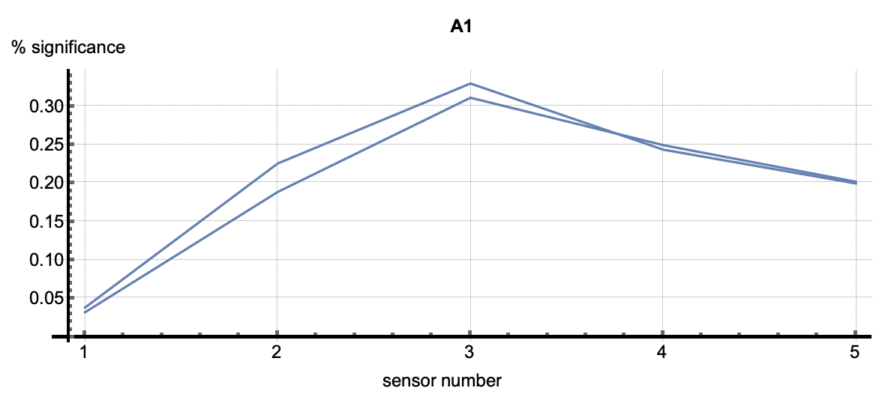
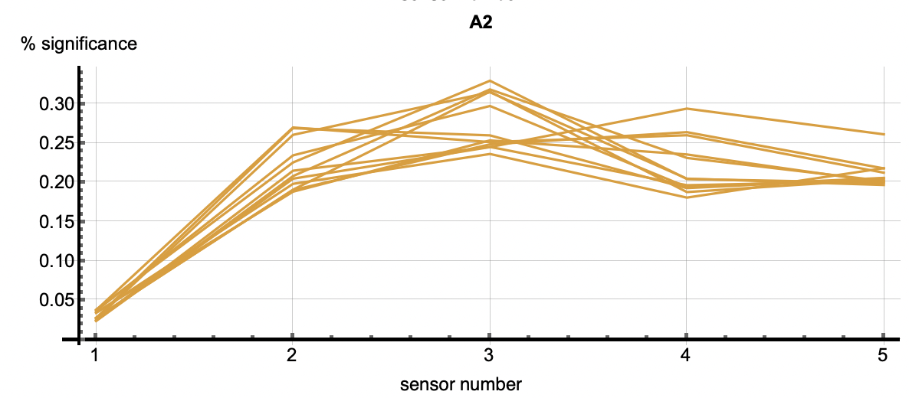
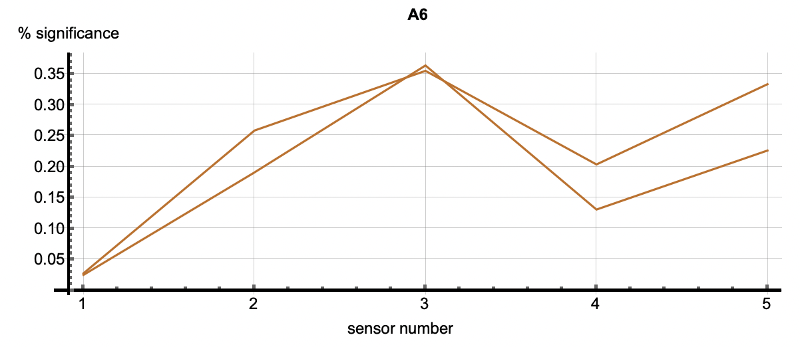

   
# Example: Anomaly Detection in a Multi-Sensor Asset (Sensor Fusion)

## Introduction

One the most powerful capabilities of Amber can be seen when it processes sensor fusion vectors streaming from a multi-sensor asset. Traditional anomaly detection approaches look for min/max excursions of individual sensors beyond some statistically defined normal range. But what happens if each individual sensor value is within the statistical limits of its normal operation, but there is a *relational anomaly* between sensors? These relational anomalies can give the earliest indication of asset non-compliance. The machine learning model that Amber builds characterizes both individual sensor behavior and the complex variations in the relationship *between* sensors. 

<table class="table">
  <tr>
    <td></td>
  </tr>
  <tr>
    <td><em>Figure 1: Examples of sensor relationships for a motor asset. (a) shows a normal state of "Not running" for the asset. (b) and (c) show other relationships between sensors.</em></td>
  </tr>
</table>

Imagine, for example, that a motor is rotating at 2000 RPM, and there is a corresponding current draw and vibrational frequency spectrum. This complex relationship between sensor values is captured by Amber. In another operating state, the motor might be rotating at 3000 RPM with a different corresponding current draw and frequency spectrum. There will also be many complex relational variations as the motor speed increases from 2000 to 3000 and back again. Amber integrates all of these normal relational variations into its high-dimensional model during training. Now suppose the motor is running at 2000 RPM but with a current draw that was only seen when the motor was running at 3000 RPM. This type of *relational anomaly* cannot be captured by traditional anomaly detection approaches, but it indicates that the asset is changing and possibly on a trajectory toward eventual failure. Similiary, subtle variations in the frequency spectra may indicate changing asset performance long before an operator can hear or feel any change. This is the power of Amber's machine learning based, predictive analytics model.

## Data Set
Figure 1 shows data collected from a pump asset with multiple sensors. The particular sensors in the sensor fusion vector might measure vibration, current, pressure, temperature, humidity, torque, etc. Figure 2 shows the data from Figure 1 rendered on a single plot. We train on the first 10,000 samples and after Autotuning and Learning Amber enters the Monitoring state.

<a href="AmberDemo_Data.csv" download>Download Data Set</a>

<table class="table">
  <tr>
    <td></td>
  </tr>
  <tr>
    <td><em>Figure 2: Six anomalies in the data are shown as A1 through A6. A3 through A6 are anomalies that can be detected using traditional techniques. Anomalies A1 and A2 are relational anomalies only visible to Amber's high-dimensional model.    </em></td>
  </tr>
</table>

## Amber Configuration
To get these results, we configure Amber with following settings

* Feature Count: 5
* Streaming Window Size: 1
* Samples to Buffer: 10000
* Learning Rate Max Clusters: 1000
* Learning Rate Max Samples: 1000000
* Learning Rate Numerator: 10
* Learning Rate Denominator: 10000
* Batch Size: 10

The Feature Count is set to 5 since there are 5 features in each sensor fusion vector. Setting the Streaming Window Size to 1 means that each sensor fusion vector is considered on its own and not in relation the preceding sensor fusion vectors. Samples to Buffer is set to 10,000 since, for this data set, that is enough to capture both the normal "Not Running" state and the normal running states for this asset. Setting the Learning Rate Numerator to 10 and the Denominator to 10,000 means that Amber will switch automatically from Learning to Monitoring when there are fewer than 10 new clusters created over 10,000 consecutive samples. The Batch Size of 10 means that 10 samples from the data set were sent in each request to Amber. 

## Amber Results
Using the data set provided and the Amber configuration above, you should get results for the Anomaly Index (SI) that look as shown in Figure 2. The complete set of Amber results are in this file.
 
<a href="AmberDemo_Results.csv" download>Download Amber Results</a>

### Interpreting Root Cause
Root Cause Analysis applies to all clustered patterns, but most often is used in the analysis of anomalous patters. Using the cluster IDs associated with the six flagged anomalies, the root cause analysis vectors correlate with each anomaly. Each detection has multiple cluster IDs associated with it. The root cause vectors associated with the cluster IDs for one anomalous flagging are shown by each of the vectors shown in one of the following images. The six images correlate to the six anomaly detections shown above. 

<table class="table">
  <tr>
    <td></td>
    <td></td>
    <td></td>
  </tr>
  <tr>
    <td></td>
    <td></td>
    <td></td>
  </tr>
  <tr>
    <td colspan="3"><em>Figure 3: The six plots are associated with the six anomalies talked about above. The vectors in each figure are associated with the clusters that occured in each detection. The first two plots show relatively equal significance across the features. In other words, these two relational anomalies have no specific features that caused the detection but rather the correlation across features caused it. A3 through A6 however, have a higher significance with feature 5 as well as 2 or 3 depending on the detection. This shows that those features were most significiant in the creation of those clusters. Those features may be considered as diagnostic in understanding why this event was an anomaly. </em></td>
  </tr>
</table>

