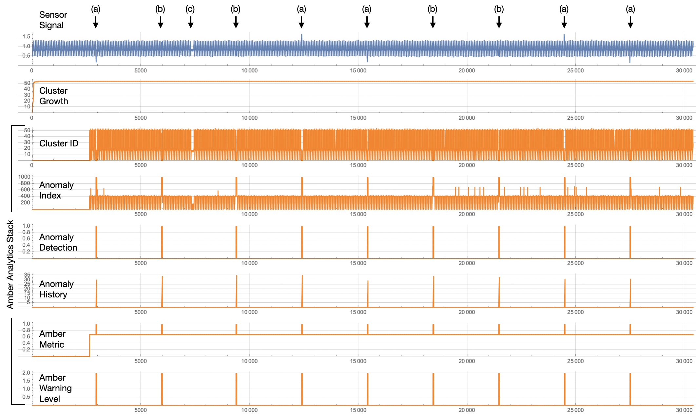

   
# Example: Anomaly Detection in a Single-Sensor Time Series

## Introduction

Servo-motors are used throughout industry to create precise motion paths and consistent rotational profiles. The resistance to cutting and rotating motions creates torque, and the changes in torque will track with the motion profile of the servo-motor. Torque anomalies in manufacturing can occur for many reasons including a broken coupling, worn tooth in a gear, a belt slip, and many other reasons. One way to detect a torque anomaly is to use the servo-motor's control loop as it adjusts the output current in real time to keep the actual position of the motor shaft as close as possible to the programmed position.

Figure 1 shows 30,400 output current samples from a bottle-capping, motion profile. We will look more closely as this signal as it is processed through Amber, but for now we note three different types of anomalies. The anomalies at (a) show the output current clearly going outside of its normal range of values. This type of anomaly can easily be detected without machine learning using a statistical characterization of the typical ranges of values. The anomalies at (b) show a much more difficult type of anomaly to detect as the current falls within the normal range of values for the motion profile. The anomaly at (c) may or may not be an anomaly depending on the user's definition of the motion profile, which may allow for a longer pause between motions under certain circumstances. Amber can easily detect all of these types of anomalies, including either detecting anomalies like (c) or not depending on how Amber is configured.

<table class="table">
  <tr>
    <td></td>
  </tr>
  <tr>
    <td><em>Figure 1: The output current of a servo-motor with three types of anomalies marked: (a), (b), and (c).</em></td>
  </tr>
</table>

## Cluster Growth

Amber learns normal variation in the output current as it begins processing the overlapping streaming windows. When significant new variation is found Amber adds new clusters to the model to capture that aspect of the input signal (Figure 2). This increasing number of clusters in the model creates what we call the *learning curve* for the asset. The example in Figure 2 is for a very simple motion so most of the normal variation is learned within the first 300 samples. More complex motion profiles (such as the non-rotational motion profiles of robots) may require thousands, tens of thousands, or even hundreds of thousands of samples to define all of the normal variation in the sensor time series. This is not a problem for Amber it can support hundreds or even thousands of clusters, creating an extremely high-dimensional model of the asset. 

<table class="table">
  <tr>
    <td></td>
  </tr>
  <tr>
    <td><em>Figure 2: Cluster growth as Amber learns normal variation in the output current of a servo-motor creates an increasing learning curve. In this case, after two motion cycles nearly all variation is learned by Amber as shown by (a) and (b). The streaming windows near (c) and (d) find new variation and so new clusters are added to the model.</em></td>
  </tr>
</table>

As shown in Figure 2, the growth in cluster count is steep at first as nearly every pattern is new to Amber. As more data is consumed, Amber begins to find repetition of existing patterns already in its model so fewer new clusters are created. Eventually, the slope of this learning curve levels off and the Amber model is considered to be mature.

## The Amber Analytic Stack

As this signal has only one associated time series (the output currrent), we configure Amber with just one feature. We will configure Amber with two different Streaming Windows Sizes to observe the different effects of those windows. (For more information about the Streaming Window Size and other Amber configuration parameters, see [Single-Feature Processing](../Overview.md#Single_Feature).)

Once configured, Amber is ready to start processing current values coming from the servo-motor. As it processes these current values, Amber will build a high-dimensional machine learning model describing what normal variation is for this rotational asset. For each current value sent to Amber, six corresponding Amber outputs are sent back, each with its own specific meaning. This creates was we call the **Amber Analytic Stack** (Figure 3).

<table class="table">
  <tr>
    <td></td>
  </tr>
  <tr>
    <td><em>Figure 3: The Amber Analytic Stack for a Streaming Window Size of 25. Each output current sample sent to Amber is processed and six machine learning outputs are returned.</em></td>
  </tr>
</table>

### (ID) Cluster ID

Although rarely used directly, the Cluster ID is a core analytic output of Amber as it designates the cluster to which each streaming window is assigned. (See The [Amber Operational Overview](../Overview.md#Operation) for more details on the Amber training phases. As seen in Figure 4, the cluster ID is 0 during Buffering and Autotuning. During this period, Amber is waiting for sufficient data in order to automatically set its hyperparameters. Once the Amber hyperparameters have been set, we see a somewhat repetive pattern of cluster IDs than can be used to link similar streaming windows through the incoming sensor data.

<table class="table">
  <tr>
    <td></td>
  </tr>
  <tr>
    <td><em>Figure 4: Once Buffering and Autotuning is complete, a cluster ID is returned for each sample sent to Amber. At (a), Amber is in Monitoring state and learning is turned off. Thus, when the anomaly occurs in the signal, no new clusters are created and Amber returns a 0 for the Cluster ID. </em></td>
  </tr>
</table>

The most important use of the Cluster ID is that it provides a lookup key into the other core analytics of Amber.

### (SI) Smoothed Anomaly Index

The Smoothed Anomaly Index (SI) is derived from the Cluster ID as the relative frequency of occurrence of the cluster to which the corresponding streaming window was assigned. Values closer to 0 represent very common streaming window patterns and values close to 1000 represent very uncommon patterns, that is, anomalous patterns.

<table class="table">
  <tr>
    <td></td>
  </tr>
  <tr>
    <td><em>Figure 5: Once Buffering and Autotuning is complete, a Smoothed Anomaly Index is returned for each sample sent to Amber.  </em></td>
  </tr>
</table>

The SI value is one of the most useful core analytics for detecting anomalies. As can be seen in Figure 5, the anomaly in the sensor signal is detected as a spike in the Anomaly Index. Figure 6 shows two more examples of anomaly detections. The Anomaly Index plot on Figure 3 shows all of the detections (which were 100% in this example).

<table class="table">
  <tr>
    <td></td>
  </tr>
  <tr>
    <td><em>Figure 6: The detection latency is shown at (a) and (b). It will always be less than the streaming window size and typically much shorter, which in this case was configured for 25 samples.  </em></td>
  </tr>
</table>

### (AD) Anomaly Detection, (AH) Anomaly History

Just before switching from Learning to Monitoring state, Amber computes an optimal threshold for the SI value that indicates the value at which the SI measurement should be considered an anomaly. For a very clean signal like this one, that value will be 1000, the maximum value for SI. Whenever SI crosses this the optimal threshold value, an Anomaly Detection is recorded as shown in Figure 7. The Anomaly Detection value is 0 if SI is below threshold and 1 if SI is equal to or greater than the anomaly threshold. The anomaly history counts the number of 1's in the recent AD time course. As can be seen in Figure 7, AH grows quickly from 0 to 35.

<table class="table">
  <tr>
    <td></td>
  </tr>
  <tr>
    <td><em>Figure 7: The Amber Analytics Stack for one of the anomalies.</em></td>
  </tr>
</table>

### (AM) Amber Metric, (AW) Amber Warning Level

Many complex assets show an ongoing background level of anomalies regardless of how much training is done. The Amber Metric (AM) uses a Poisson model based on the number of background anomalies observed prior to Monitoring state. The Amber Metric, when it is very close to 1.0 is indicating a statistically significant deviation from the model that was created during training. The Amber Warning Level (AW) is 0 when the AM is less than 2 Poisson standard deviation of the background level of anomalies during training. AW is 1 to indicate 2 to 3 standard devations and AW is 2 to indicate more than 3 standard deviations. In Figure 7, the AW values is only at level 1 for a single sample as it jumps to AW = 2 during the anomaly. Once the AW = 2 level is reached and no more anomalies are detected (AD = 0) then AH is reset to 0.

### The Effect of the Streaming Window Size Parameter

As described in [this section](../Overview.md#Single_Sensor), the configured streaming window size parameter determines the size of anomaly (in samples) that will be detected by Amber. As shown in Figure 8 (and can also be seen in Figure 3), there is an unusually long gap between current surges near sample 7350. Depending on the motion profile, this may or may not be considered an anomaly by the subject matter expert. With SWS = 25, Figure 8(a) is a feature that occurs many times in the sensor signal (such as at Figure 8(b)). Thus, it is not considered an anomaly. However, with SWS = 100, the long gap at (c) has no counterpart anywhere in the sensor signal. So it creates a large corresponding Anomaly Index value and is detected as an anomaly.

<table class="table">
  <tr>
    <td></td>
  </tr>
  <tr>
    <td><em>Figure 8: The only difference between the Amber run on the left and the Amber run on the right is two different settings for the Streaming Window Size. When the SWS = 25, no anomaly is detected for the unusually long gap between bottle-capping current surges. With SWS = 100, the long gap is detected as an anomaly.</em></td>
  </tr>
</table>

## Amber Data, Configuration, and Results

Here is the data set used to produce the results above. It was collected from an Allen-Bradley servo-motor.

<a href="spliced_data.csv" download>Download Data Set</a>

To get these results, we configure Amber with following settings

* Feature Count: 1
* Streaming Window Size: 25 (or 100)
* Samples to Buffer: 1000
* Learning Rate Max Clusters: 1000
* Learning Rate Max Samples: 1000000
* Learning Rate Numerator: 1
* Learning Rate Denominator: 1000

The Feature Count is set to 1 since there just the one feature in this time series. Setting the Streaming Window Size to 25 means Amber will look at 25 consecutive samples as one pattern to be clustered. Setting the Streaming Window Size to 100 means Amber will look at 100 consecutive samples as one pattern to be clustered. Samples to Buffer is set to 1000 since, for this data set, that is enough to capture both the normal running states for this asset. Setting the Learning Rate Numerator to 1 and the Denominator to 1000 means that Amber will switch automatically from Learning to Monitoring when there are fewer than 1 new clusters created over 1000 consecutive samples. 

Using the data set provided and the Amber configuration above, you should get results for the Anomaly Index (SI) that look as shown in Figure 3. The complete set of Amber results are in these file.
 
<a href="SWS25_Results.csv" download>Download Amber Results for SWS = 25</a>

<a href="SWS100_Results.csv" download>Download Amber Results for SWS = 100</a>

### Interpreting Root Cause
In the case of single sensor, root cause does not provide any additional information about the results. The purpose of root cause is to determine which feature is of interest when the new cluster was created, but in single sensor, there is only one source for all the features.

